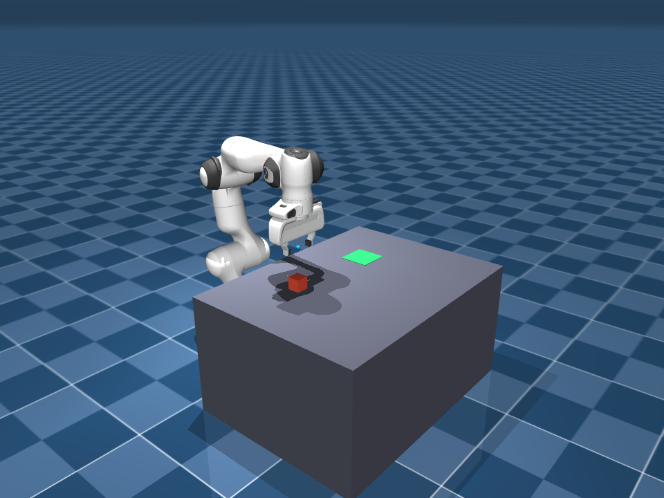
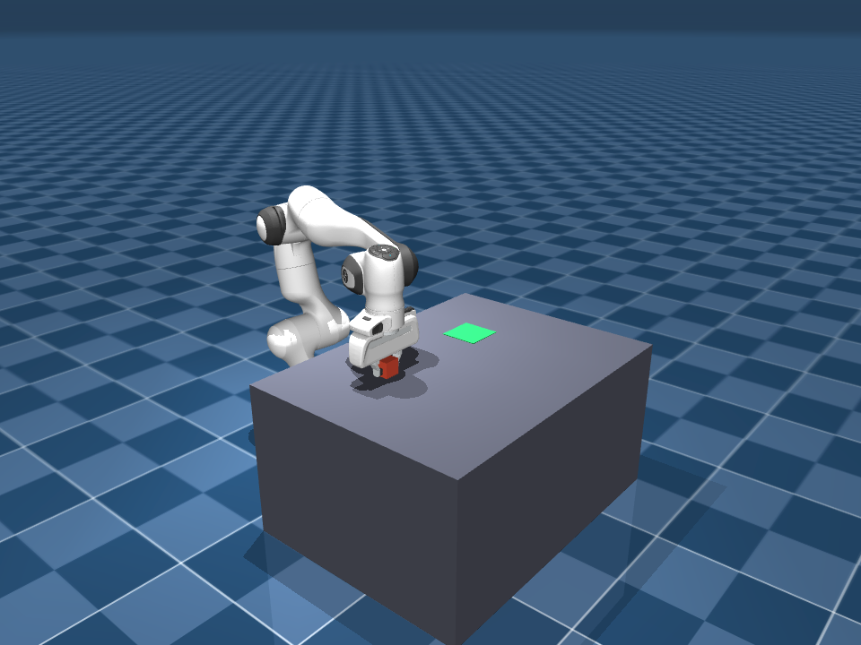
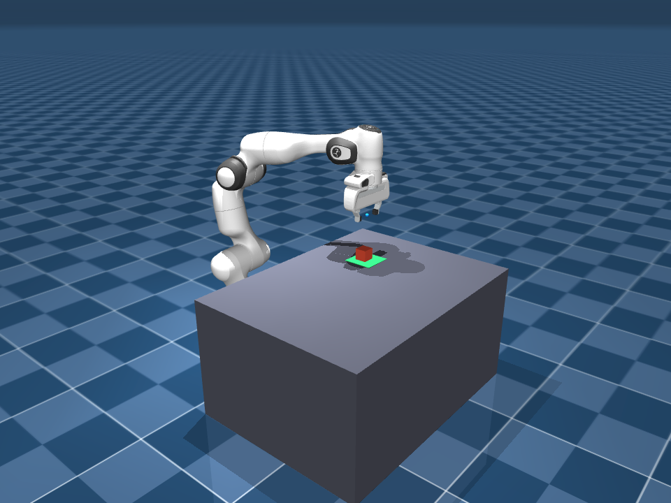

# Panda Pick & Place · 机械臂抓取放置演示

> 具身智能 / Embodied AI —— Franka Emika Panda 七自由度机械臂在 MuJoCo 中完成一次完整的「抓取-放置」任务。
> 技术栈：**MuJoCo 物理仿真 + 阻尼最小二乘（DLS）逆运动学 + 关节位置执行器 + 力控夹爪**，全部 CPU 可跑，无需 GPU 或额外硬件。

## ▶ 演示（Demo）

  <video src="https://github.com/user-attachments/assets/969102fe-9ee4-42d2-9df9-bef9a027c857" width="720" controls></video>

*离线渲染的关键阶段帧（frames/）：*

| 阶段 | 画面 |
|------|------|
| 00 接近方块上方 |  |
| 02 闭合夹爪 |  |
| 04 搬运到放置点上方 |  |
| 07 撤离 |  |

完整 8 张阶段帧见 [`frames/`](frames/) 目录。

## 这个项目在做什么

机械臂从初始位姿出发，依次完成：

**接近方块上方 → 下降 → 闭合夹爪 → 提起 → 搬运到放置点 → 下降放置 → 松开 → 撤离**

这是具身智能里「运动规划 + 抓取」的最小闭环，也是最能体现"机器人真的会干活"的演示之一：
碰撞、接触、摩擦、抓取完全由物理引擎计算，不需要任何手工接触逻辑。

## 用的技术

| 技术点 | 实现 | 说明 |
|--------|------|------|
| 物理仿真 | MuJoCo + Menagerie 官方 Panda 模型 | 碰撞 / 接触 / 摩擦 / 抓取由引擎求解 |
| 逆运动学（IK） | **阻尼最小二乘 DLS**（`mj_jacSite` 取雅可比伪逆） | 在任务空间（笛卡尔）定义末端目标位姿，逐周期解 7 个关节角；雅可比直接从模型取出，**不写手工运动学** |
| 轨迹平滑 | `smoothstep` 插值 | 阶段间目标点平滑过渡，避免速度突变 |
| 关节执行 | 位置执行器跟踪 IK 解 | `ctrl = 目标关节角`，物理负责落地 |
| 夹爪 | 力控"弹簧"执行器（抓取力约 12N） | 把 Menagerie 原版偏软的夹爪调到能稳抓 4cm 方块 |
| 渲染 | `mujoco.Renderer` + imageio，或实时 3D viewer | 离线输出 mp4 + 关键帧 PNG；`--viewer` 可开实时窗口 |

### 几个值得展开的工程设计

- **IK 与仿真状态严格隔离**：逆运动学在独立的 `ik_data` 上做正运动学，绝不修改仿真 `data`。
  否则每周期把机械臂"瞬移"一次，接触 / 摩擦会被破坏，抓取必失败——这是基于模型的 IK + 仿真最容易踩的坑。
- **阻尼最小二乘抑制奇异位形**：`dq = Jᵀ(JJᵀ + λ²I)⁻¹ e`，`λ²=1e-3` 抑制奇异附近的巨大关节速度，并做单步限幅。
- **力控弹簧夹爪**：`力 = gain·ctrl − 600·指间距`，张开 255 / 闭合 30，捏住方块压出约 9N 夹持力，且不会夹空卡死。

---

*Simulation: MuJoCo · Robot: Franka Emika Panda (Menagerie) · Runs on CPU.*
