# EmbodiedSim_Demo · 具身智能仿真合集（MuJoCo）

八个自包含的 MuJoCo 机器人仿真项目，覆盖具身智能从**经典控制**到**学习控制**的主要层次：
机械臂抓取分拣、人形操作（工位 / 全身协同）、灵巧手多指掌内操纵、人形双足运动控制，
以及建立在同一个灵巧手环境上的**强化学习 / 模仿学习 / 力控与 MPC**。

每个项目都满足：**纯 CPU 可跑 · 模型随仓库打包 · 一条命令复现 · 结果自动校验**。

01–05 是**经典控制**（逆运动学 + PD 力矩 + 解析轨迹），06–08 是**学习与优化**，
而且 06/07/08 刻意共用 03 那只 Shadow Hand 和同一个任务定义，于是三件事可以直接对比：

| 同一个任务：把掌内的球搓到指定角度 | 方法 | 实测成功率 |
|---|---|---|
| [03](#03-灵巧手--掌内操纵) 经典 | 四指行波协同（参数扫描标定） | **100%** |
| [06](#06-强化学习--掌内定向旋转) 学习 | PPO / SAC，**无示范**、纯奖励 | **0%**（学会了握稳，没学会搓转） |
| [07](#07-模仿学习--bc--act--diffusion-policy) 学习 | 9 套专家策略示范 → BC / ACT / Diffusion Policy | **26.7%**（DP）/ 6.7%（BC）/ 0%（ACT） |
| [08](#08-力控与-mpc--阻抗控制--mpc--onnx-部署) 优化 | 阻抗/力控 + MPC + ONNX 部署 + 手写刚体动力学 | 力跟踪误差 **< 1%**；动力学对拍 **2e-16** |

> 06 的 0% 不是"没做完"，而是一个**结论**：接触富集的精细时序操作，纯 RL 从零学
> 需要远超本次 CPU 预算的算力（PPO 700k 步 ≈ 16 分钟；典型机器人 RL 论文用 GPU 集群
> 跑 1e8~1e9 步）。而且 **PPO 与 SAC 这两个完全不同的算法族，最后收敛到了同一个解**，
> 说明瓶颈不在算法调参，而在任务本身的探索结构。这正是 07 引入示范的动机。

---

## 项目一览

| # | 项目 | 机器人（自由度） | 一句话看点 |
|---|---|---|---|
| 01 | [机械臂 · 物流分拣](#01-机械臂--物流分拣) | Franka Emika Panda（7） | 传送带送料 + DLS 逆运动学抓取 + 按色分拣入箱 |
| 02 | [人形 · 物流带分拣](#02-人形--物流带分拣腰部回转--全身协同) | Unitree H1（19） | 2.3 m 输送带 + **腰部回转身取件**，5-DoF 全身 IK |
| 03 | [灵巧手 · 掌内操纵](#03-灵巧手--掌内操纵) | Shadow Hand E3M5（24） | 五指包络抓取 + **四指行波搓球** + 翻腕卸料 |
| 04 | [人形 · 工位分拣](#04-人形--工位分拣) | Unitree H1（19） | 实测站姿标定 + 4-DoF 臂 IK + best-of-seeds 破局部极小 |
| 05 | [人形 · 运动控制](#05-人形--运动控制) | Unitree H1（19） | 双足行走 + **抗扰动平衡** + 全身协同 + 原地转向 |
| 06 | [强化学习 · 掌内定向旋转](#06-强化学习--掌内定向旋转) | Shadow Hand（24） | Gymnasium 环境 + PPO/SAC，**无示范纯奖励**，与经典专家同环境对照 |
| 07 | [模仿学习 · BC / ACT / Diffusion Policy](#07-模仿学习--bc--act--diffusion-policy) | Shadow Hand（24） | **多模态示范**下 BC 平均化失效，Diffusion Policy 能复现模式 |
| 08 | [力控与 MPC · 阻抗控制 / MPC / ONNX 部署](#08-力控与-mpc--阻抗控制--mpc--onnx-部署) | Shadow Hand（24） | 接触力峰值定量对比、MPC vs DLS-IK、策略 ONNX 导出与延迟基准 |

---

## 01 机械臂 · 物流分拣

Panda 机械臂 + 传送带 + 三色分类箱，完整跑通「感知 → 抓取 → 放置」闭环。

- **模型**：Franka Emika Panda（7 自由度，MuJoCo Menagerie 官方模型）
- **依赖**：`mujoco` `numpy` `imageio`

### 关键帧

| | |
|---|---|
| 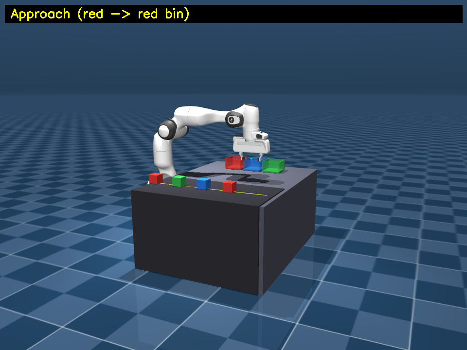 **① 传送带送料** — 彩色料箱排队流动到抓取点 |  **② 抓取 red** — DLS 逆运动学定位 + 力控夹爪 |
| 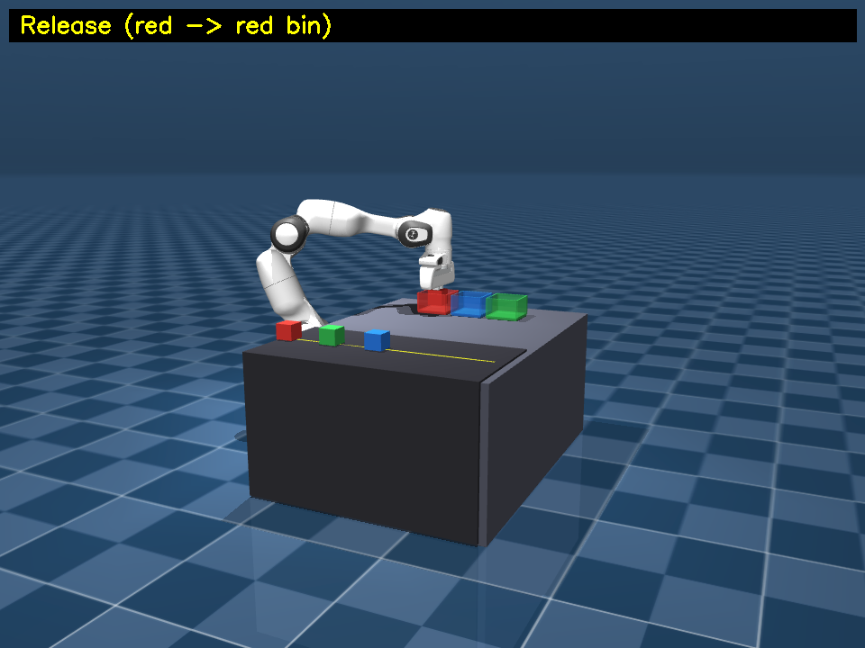 **③ 放入 red 箱** | 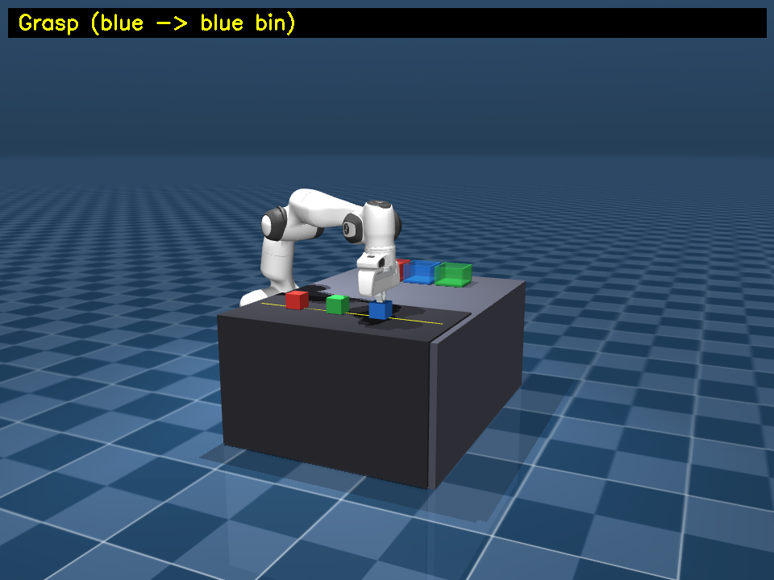 **④ 抓取 blue** |
| 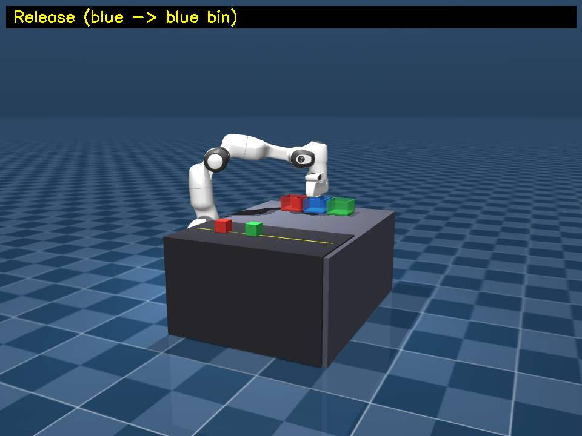 **⑤ 放入 blue 箱** | 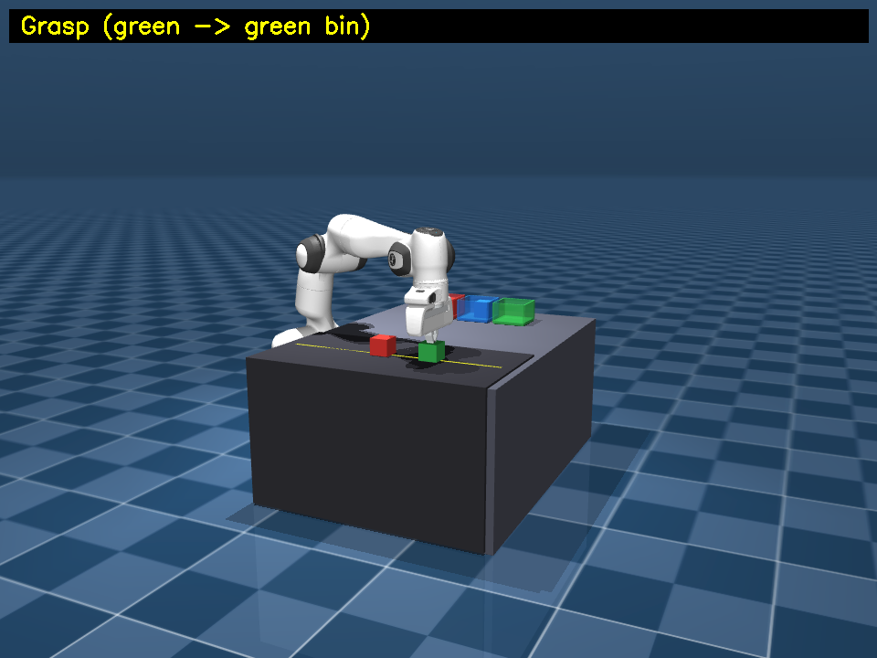 **⑥ 抓取 green** |

### 实测指标

| 指标 | 数值 |
|---|---|
| 分拣正确性 | **4 / 4 全部正确** |
| 入箱定位偏差 | 约 **2 cm** |
| 夹持力 | 约 **12 N**（力控弹簧夹爪） |

### 技术要点

| 技术点 | 实现 |
|---|---|
| 物理仿真 | MuJoCo + Menagerie 官方 **Franka Emika Panda** 7-DoF 模型 |
| 逆运动学 | **阻尼最小二乘（DLS）**：`dq = Jᵀ(JJᵀ + λ²I)⁻¹ e`，雅可比由 `mj_jacSite` 从模型直接获取，不写手工运动学 |
| 关节控制 | 位置执行器跟踪 IK 解；夹爪为力控弹簧执行器 |
| 轨迹平滑 | `smoothstep` 插值，阶段间目标点平滑过渡，避免速度突变 |
| 感知接口 | `classify()` 独立成函数 —— 换成真实视觉模型输出即可接入，控制层无需改动 |
| 场景 | 工作台 + 传送带（带黄色标线）+ 三个彩色分类料箱，全部由 `MjSpec` 程序化构建 |
| 节拍控制 | 抓取期间传送带暂停（stop-and-go 分拣），放完自动续送下一件 |

两个值得展开的工程设计：

- **IK 与仿真状态严格隔离**：逆运动学在独立的 `ik_data` 上做正运动学，绝不修改仿真 `data` ——
  否则每个控制周期把机械臂"瞬移"一次会破坏接触/摩擦，抓取必失败。
- **阻尼抑制奇异位形**：`λ` 项抑制奇异附近的巨大关节速度，并对单步关节增量做限幅，
  避免机械臂在腕部奇异点附近抖振。

### 运行

```bash
python 01_arm_logistics_sorting/logistics_sorting.py            # 出关键帧图片
python 01_arm_logistics_sorting/logistics_sorting.py --viewer   # 实时 3D 窗口
```

---

## 02 人形 · 物流带分拣（腰部回转 / 全身协同）

H1 站在整条物流带旁，靠**腰部回转身**取件、再回转身按颜色分拣入槽。

- **模型**：Unitree H1（19 DoF，MuJoCo Menagerie 官方模型）
- **场景**：自建大型输送带产线（2.3 m 带面 + 护栏 + 支腿 + 运动挡条）

动作链：输送带上料 → 队列进位（singulation）→ 腰部回转取件 → 按色入槽

### 关键帧

| | |
|---|---|
| 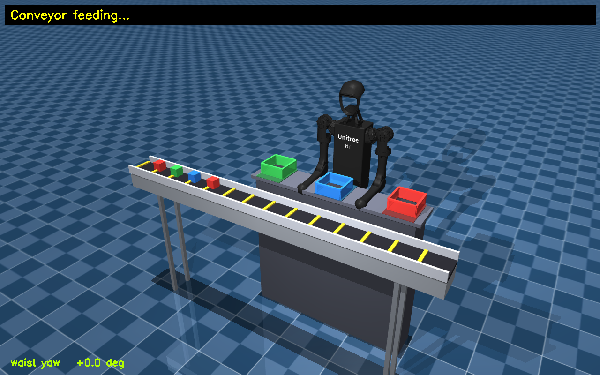 **① 物流带送料** — 料箱在带面上排成队列 | 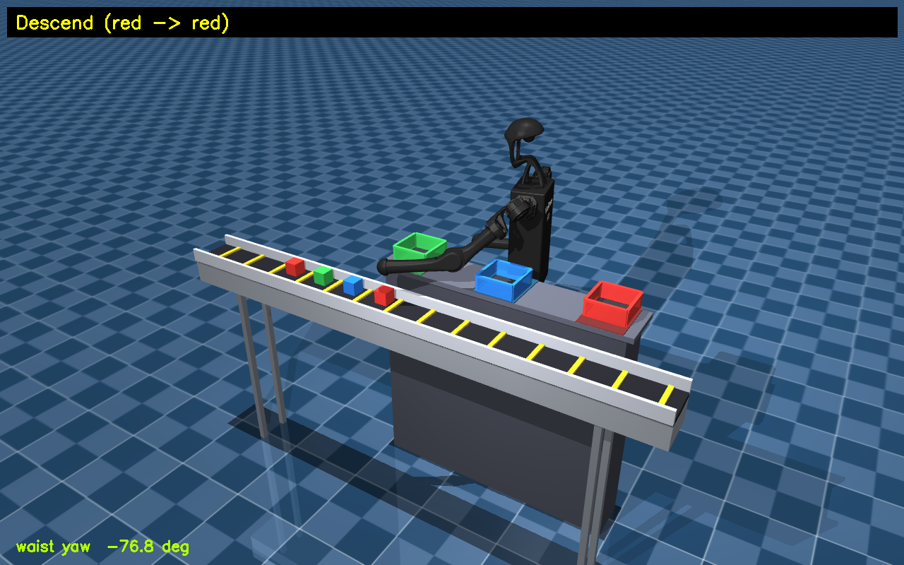 **② 腰部回转取件** — 腰转到带子另一侧够到红箱 |
| 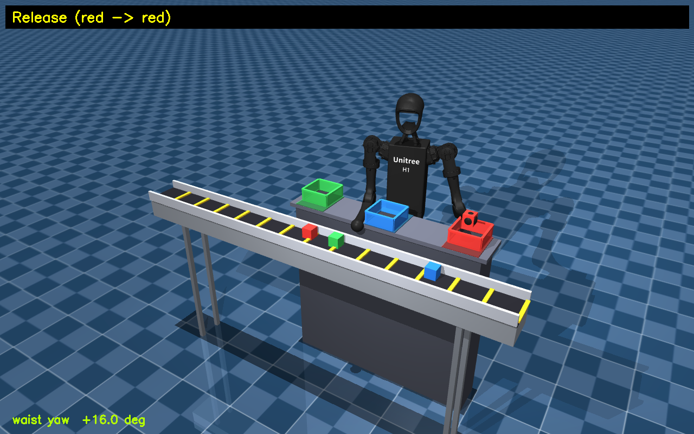 **③ 放入红槽** — 回转身把红箱送进红槽 | 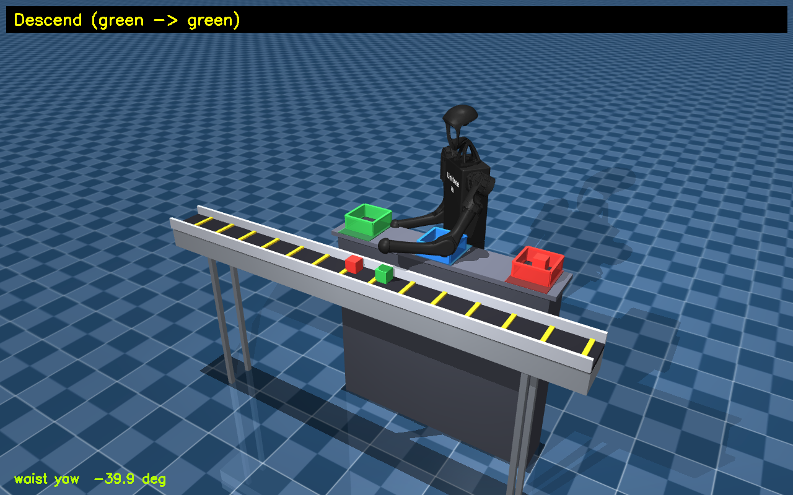 **④ 腰部回转取绿** — 再回转到另一工位 |
|  **⑤ 抓取绿箱** | 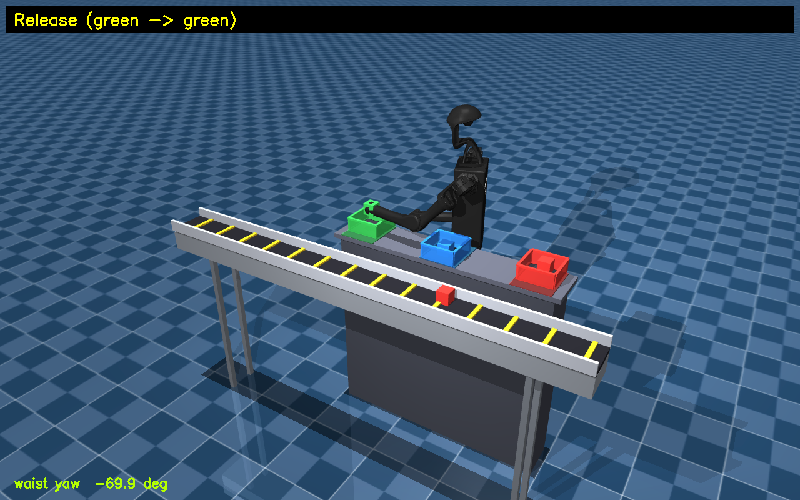 **⑥ 放入绿槽** |

### 实测指标

| 指标 | 数值 |
|---|---|
| 分拣正确性 | **4 / 4 全部正确** |
| 入槽水平偏差 | ≤ **4.3 cm**（两个同色件同槽分位，属设计值） |
| **腰部回转最大偏航** | **101.2°**（`torso` 关节量程 ±135°） |
| 末端跟踪残差 | ≤ 约 **2 cm** |

### 技术要点

**1. 腰部回转并入逆运动学 —— 5-DoF「全身 IK」**

H1 的 `torso` 是绕 **z 轴**的偏航关节（`axis="0 0 1"`，量程 **±2.35 rad = ±135°**），电机力矩 ±200 N·m。
本项目把 **腰 1 + 左臂 4 = 5 个自由度**一起放进阻尼最小二乘 IK：

```
[Jp[:, dof]] · dq = err          # 3 维位置误差，5 个未知量 => 2 个冗余自由度
dq = Jᵀ (J Jᵀ + λI)⁻¹ err        # λ 抑制奇异
```

腰部回转的物理作用：左肩不在身体中轴上（在 y = +0.155 m），**腰部负向偏航会把左臂甩到身体右侧**，
于是带子另一侧的工位也能被左臂够到。实测手臂可达 y ∈ [−0.45, +0.45]（x = 0.50 处），残差均 < 0.05 cm。

**2. 腰先转、臂补偿（双速率协同）**

```
腰：torso_cmd 以 ≤1.10 rad/s 速率限幅平滑回转到规划角   —— 宏观大动作
臂：4-DoF IK 以「实际腰角」为参考构型跟踪手端目标        —— 微观补偿
```

即"腰负责够远侧、臂负责精定位"。好处：腰的运动连续可解释，手臂精度不受腰部动态影响，
也不会出现 IK 在冗余自由度上乱跳。

**3. 输送带队列（拟真 singulation）**

```python
belt = sorted(在带料箱, key=-y)          # 队首 = y 最大
limit = None
for it in belt:
    new_y = it.y + BELT_SPEED * dt
    if limit: new_y = min(new_y, limit)  # 不许越过前车
    new_y = min(new_y, it.station_y)     # 到自己的工位就停
    it.y, limit = new_y, new_y - ITEM_GAP
```

**4. 站立与驱动**

- **固定基座人形**：骨盆 weld 到世界，并把 weld 锚点与 `home` 关键帧对齐（`HOME_Z = 0.98`），
  避免模型内置 `<body pos="0 0 1.06">` 把腿顶成外八字。
- **计算力矩**：19 关节 PD + `data.qfrc_bias` 重力/科氏补偿；腰部刚度单独加大。
- ⚠️ 自由关节 **7 个 qpos / 6 个 qvel**：写 `qpos` 用 `jnt_qposadr`，写 `qvel` 必须用 `jnt_dofadr`，
  两者混用会漏速度并越界污染相邻料箱。
- 台面/带面/护栏均为**纯视觉道具**（`contype=conaffinity=0`），避免与机械臂产生非预期干涉。

### 运行

```bash
python 02_humanoid_conveyor_sorting/humanoid_conveyor.py            # 出关键帧图片
python 02_humanoid_conveyor_sorting/humanoid_conveyor.py --viewer   # 实时 3D 窗口
python 02_humanoid_conveyor_sorting/humanoid_conveyor.py --check    # 只校验逻辑，快速
python 02_humanoid_conveyor_sorting/probe5.py                       # 复核工位 / 出料槽的 IK 可达性
```

---

## 03 灵巧手 · 掌内操纵

Shadow Hand 五指包络抓取料球 → **掌内滚动搓球** → 翻腕卸料入盘。

- **模型**：Shadow Hand E3M5（左手，**24 自由度 / 20 执行器**，MuJoCo Menagerie 官方模型）
- **场景**：自建（蓝渐变天空盒 + 棋盘格地面 + 腕部立柱 + 四壁接料盘）

### 关键帧

| | |
|---|---|
| 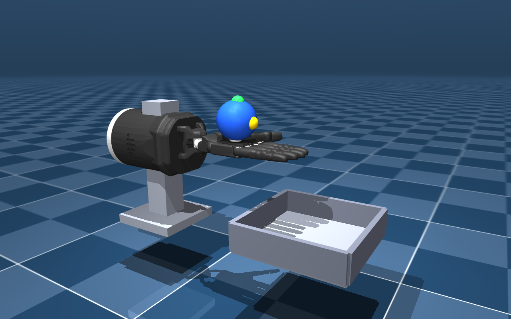 **① 张开手掌** — 24 自由度五指张开姿态 | 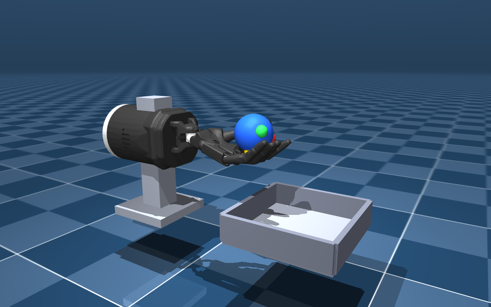 **② 料球落入掌窝** — 手指先半屈成掌窝接球 |
|  **③ 五指包络握紧** — 四指 + 拇指多点包络接触 |  **④ 掌内滚动（正向）** — 四指行波把球搓动 |
| 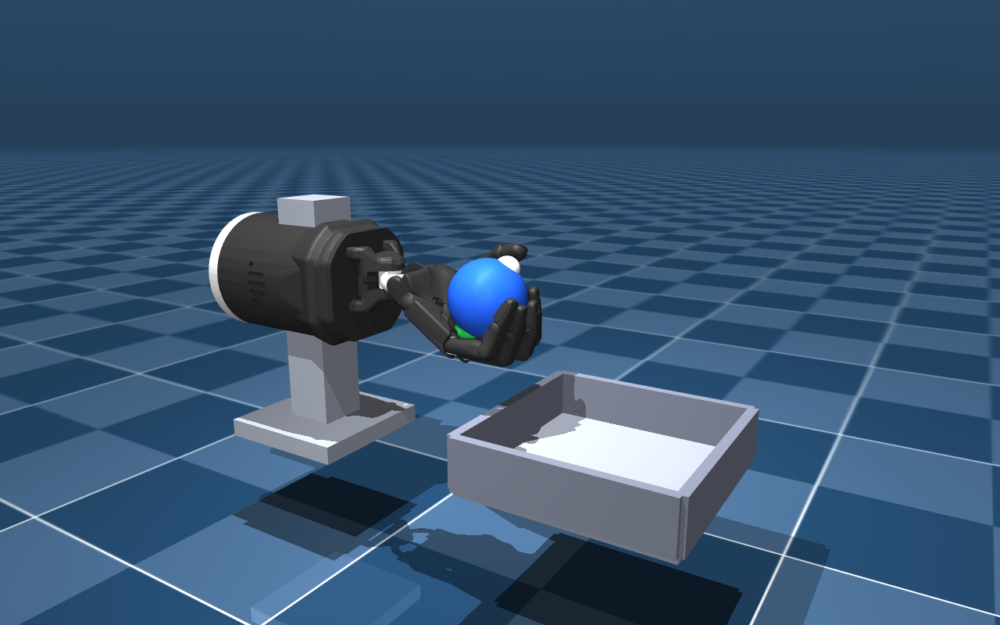 **⑤ 转过一个角度** — 球面三色标记的位置变化直接可见 |  **⑥ 掌内滚动（反向）** — 同一套协同反相即反向滚动 |
|  **⑦ 稳定持球** | 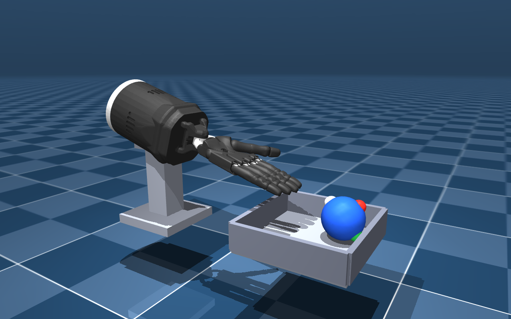 **⑧ 翻腕卸料** — 整手前倾 20° 把球倒出 |
| 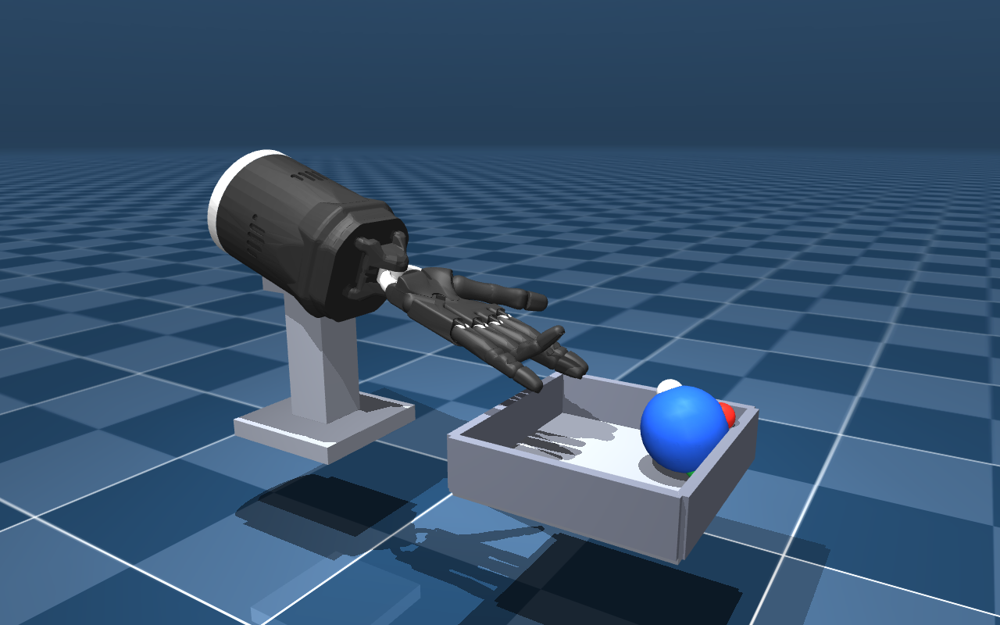 **⑨ 料球落入接料盘** | |

### 实测指标

| 指标 | 数值 |
|---|---|
| 握持接触点 | **5 ~ 6 点**（四指 + 拇指包络，滚动中随步态交替） |
| 掌内滚动累计转角 | **约 900°**（正/反向各约 450°） |
| 球在掌内的水平漂移 | **约 3 mm**（抓稳 → 滚动结束） |
| 卸料结果 | 球滚出落入接料盘，**成功** |

> "累计转角"指球体姿态在滚动过程中的**转角积分**，反映持续滚动量；"水平漂移"指球心在掌内的平移，
> 3 mm 说明球是"原地自转"而不是被推着跑。

### 技术要点

**1. 执行器映射：20 个执行器里有 4 个是"固定肌腱"执行器**

Shadow Hand 的食指有 4 个关节（J4 侧摆 / J3 近节 / J2、J1 中末节），但只有 3 个执行器：
`lh_A_FFJ0` 通过**固定肌腱**同时驱动 J2 与 J1。

```xml
<tendon>
  <fixed name="lh_FFJ0">          <!-- 其余三指同理 -->
    <joint joint="lh_FFJ2" coef="1"/>
    <joint joint="lh_FFJ1" coef="1"/>
  </fixed>
</tendon>
```

所以 **24 维的关节角不能直接当 20 维 ctrl 用**，必须按传动关系映射
（`hand_common.build_ctrl_map` 直接读模型传动信息生成，不写死索引）。

**2. 自写关节力矩控制 —— 这是本工程最关键的一步**

Menagerie 的 Shadow Hand 用 `<position kp="...">` **直接力**执行器，而 kp 只有 **0.4 ~ 1.5**，
握持力量级仅 **~1 N**，手指一搓就打滑。实测：把所有执行器力限提高 40 倍，球的转角**一个数字都不变** ——
因为瓶颈压根不是力限，而是增益。

解法：把内置执行器增益置零，改成 **24 关节 PD 力矩 + 重力/科氏补偿**（写 `qfrc_applied`）：

```python
m.actuator_gainprm[:, 0] = 0.0            # 关掉自带低增益执行器
tau = Kp * (q_des - q) - Kd * qvel + qfrc_bias   # 计算力矩
d.qfrc_applied[dof] = tau
```

**同一套协同，球的掌内转角从 8° 提升到 100°+**（12 s 内）。

**3. 掌内滚动协同：四指"行波"**

```
手指 k（FF/MF/RF/LF）的屈伸角 = 基准 + A · sin(2πft + wave·k)
```

关键是**相位随指序递进**（`wave·k`）—— 接触点沿球面**依次扫过**，才形成连续的滚动；
四指同相只会让球在掌心"原地抖"（实测同相仅 11°）。

- 拇指 `THJ1` 反向小幅摆动，提供摩擦约束、防止球被推走；
- **正/负频率即正/反向滚动**，参数由 `scan_roll_params.py` 网格扫描得到
  （净转 ~98.5°、累计 ~441°、漂移 4.4 mm / 12 s）。

**4. 为什么最后要"翻腕"才能卸料**

手掌朝上时，**张开手指球只会停在掌心**（手本身就是个托盘，实测停 11 s 纹丝不动）。
所以卸料不能靠"松手"，而是让整只手绕世界 y 轴**前倾 20°**，球顺势滚出落入接料盘 ——
这正好对应真实机械臂"端起-倾倒"的动作。

**5. 球面的三色标记只作视觉用**

球体是各向同性的，**自转肉眼完全看不出来**。所以在球面上放 4 个小色块
（`contype=conaffinity=0`，不参与碰撞、质量可忽略），滚动时色块位置变化即可直接读出姿态。

### 运行

```bash
python 03_dexterous_hand_manipulation/shadow_hand_demo.py            # 出关键帧图片
python 03_dexterous_hand_manipulation/shadow_hand_demo.py --viewer   # 实时 3D 窗口
python 03_dexterous_hand_manipulation/shadow_hand_demo.py --check    # 只校验逻辑，快速
python 03_dexterous_hand_manipulation/probe_hand.py                  # 核对执行器映射 / 关节范围 / 掌面几何
python 03_dexterous_hand_manipulation/scan_roll_params.py            # 重跑掌内滚动协同的参数网格扫描
```

---

## 04 人形 · 工位分拣

H1 站定在胸高工作台前，用左臂完成「料道送料 → 识别颜色 → 抓取 → 分入对应料箱」。

- **模型**：Unitree H1（19 DoF，MuJoCo Menagerie 官方模型）
- **场景**：自建胸高工作台 + 料道 + 红/蓝/绿三个分类料箱

### 关键帧

| | |
|---|---|
| 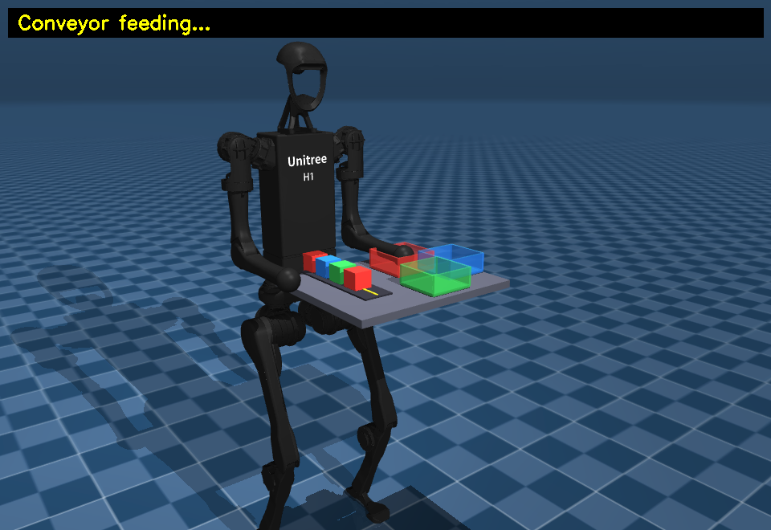 **① 传送带送料** — 料箱沿料道送到抓取点 | 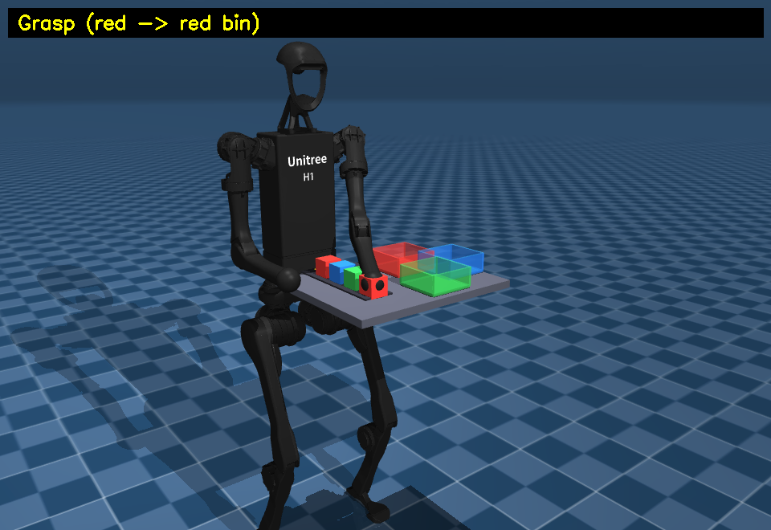 **② 抓取 red** — 左臂 4-DoF IK 定位 |
| 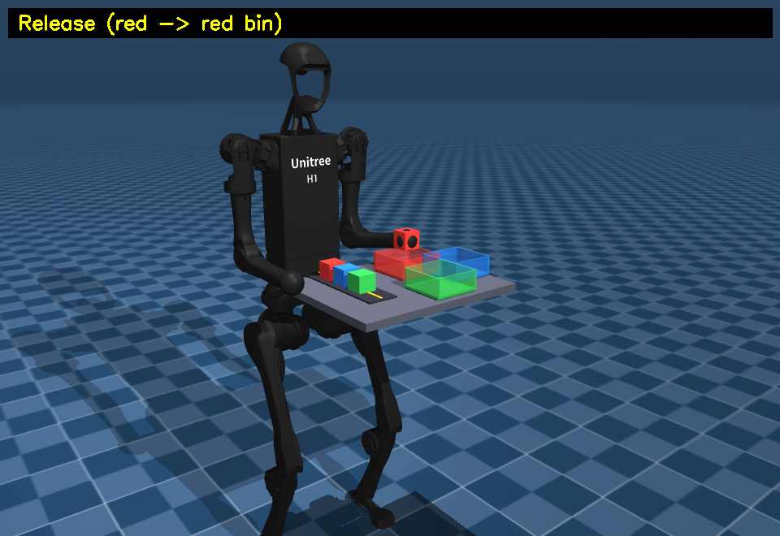 **③ 放入 red 箱** | 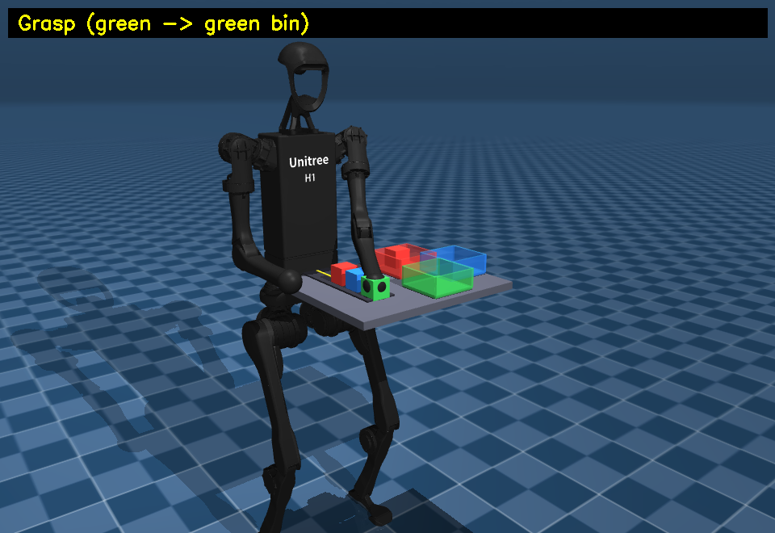 **④ 抓取 green** |
| 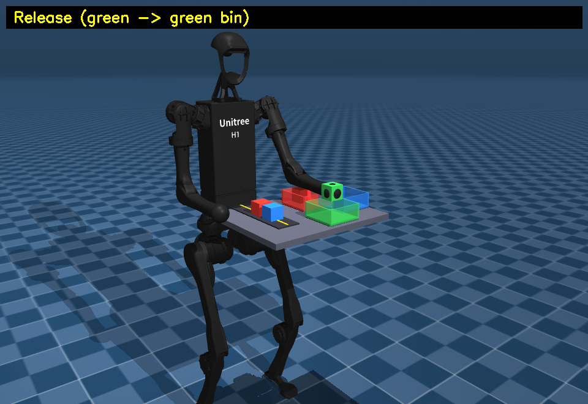 **⑤ 放入 green 箱** | 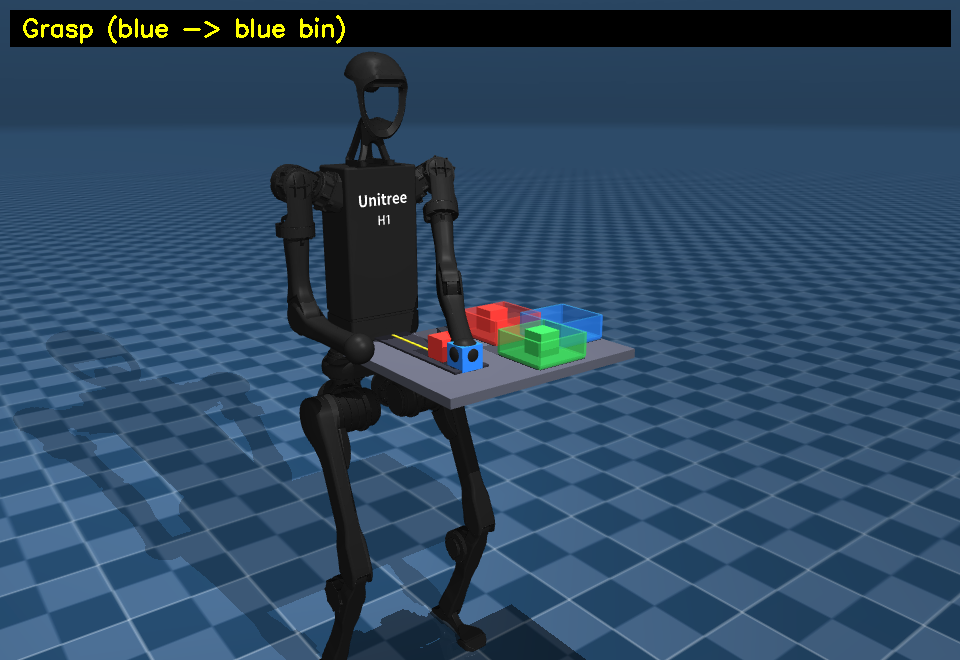 **⑥ 抓取 blue** |

### 实测指标

| 指标 | 数值 |
|---|---|
| 分拣正确性 | **4 / 4 全部正确** |
| 末端跟踪残差 | ≤ 约 **1.8 cm** |
| 入箱偏差 | ≤ **3.5 cm**（两个同色件同箱分槽，属设计值） |
| 站立稳定性 | 骨盆高度偏差 < 1 mm |

### 技术要点

**1. 工作区按「实测站姿」标定，而不是按模型默认位姿**

这里踩过一个很典型的坑：H1 的 `home` 关键帧把脚压进地面约 8 cm，
**实际稳定站立时骨盆高度是 1.06 m，而不是 keyframe 里的 0.98 m**；
同时 weld 锚点如果不显式指定，会把骨盆锁到模型编译默认位姿 `<body pos="0 0 1.06">`，
**把腿顶成外八字**（腿部关节偏差可达 0.44 rad）。

做法：把骨盆默认 z 与 `HOME_Z` 对齐（腿部偏差降到 0.007 rad），
再用探针脚本从**真实站立姿态**出发扫描可达工作区，按实测数据定工作台高度 ——
最终所有抓取点 / 料箱位的 IK 残差 < 2 cm。

**2. 两个真实的索引陷阱**

- **`jnt_qposadr` ≠ `jnt_dofadr`**：自由关节有 **7 个 qpos 但只有 6 个速度自由度**。
  写位置要用 `jnt_qposadr`，写速度必须用 `jnt_dofadr`；混用会漏清速度并越界污染相邻物体
  （料箱"凭空漂移"的根因）。同样，雅可比的列索引要用 `jnt_dofadr`。
- **`mj_jacSite` 前必须先 `mj_comPos`**，否则雅可比恒为 0，IK 原地不动。

**3. DLS 的局部极小与多初值**

同一个目标点，从"当前位姿"出发残差 5 cm，从零位出发却只有 0.1 cm。
解法是 **best-of-seeds**：当前位姿与零位各解一次，取误差更小的解。

**4. 相位推进要用「实测」手端位置判定**

原实现只看"指令到位"就切下一个相位，此时手臂其实还差几厘米没跟上，放料必然偏。
改成用 `site_xpos` 实测手端误差作为到位判据后，入箱精度稳定。

### 运行

```bash
python 04_humanoid_workcell_sorting/humanoid_sorting.py            # 出关键帧图片
python 04_humanoid_workcell_sorting/humanoid_sorting.py --viewer   # 实时 3D 窗口
python 04_humanoid_workcell_sorting/humanoid_sorting.py --check    # 只校验逻辑，快速
```

---

## 05 人形 · 运动控制

H1 的 19 自由度全身 routine：双足行走、抗扰动平衡、全身协同与定点转向 ——
不是 hello-world 式的站立演示，而是一段可直接拆解控制层次的动态 routine。

- **模型**：Unitree H1（19 自由度驱动：双腿 5×2 + 躯干 1 + 双臂 4×2）

### 关键帧

| | |
|---|---|
| 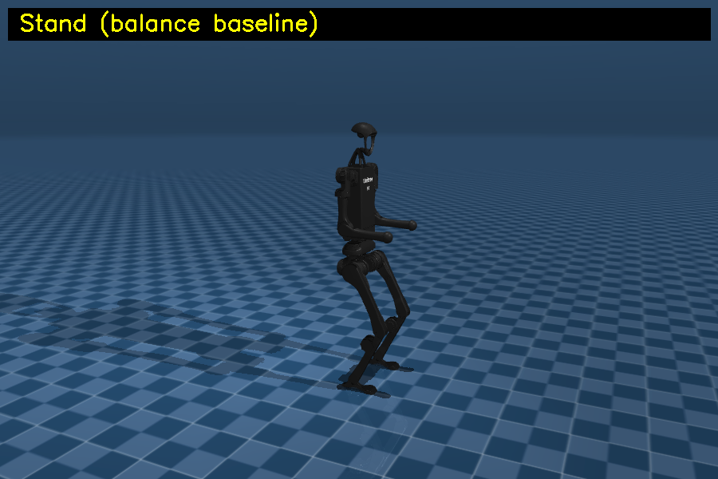 **① 双足站立保持** — 基座稳定器维持直立与高度 | 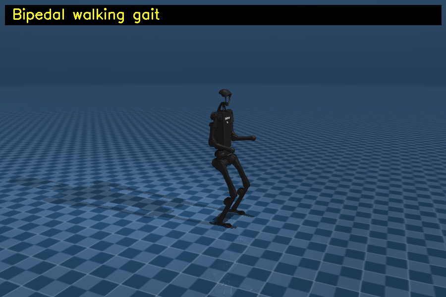 **② 双足行走步态** — 双腿反相摆动 + 重心起伏 + 摆臂协同 |
| 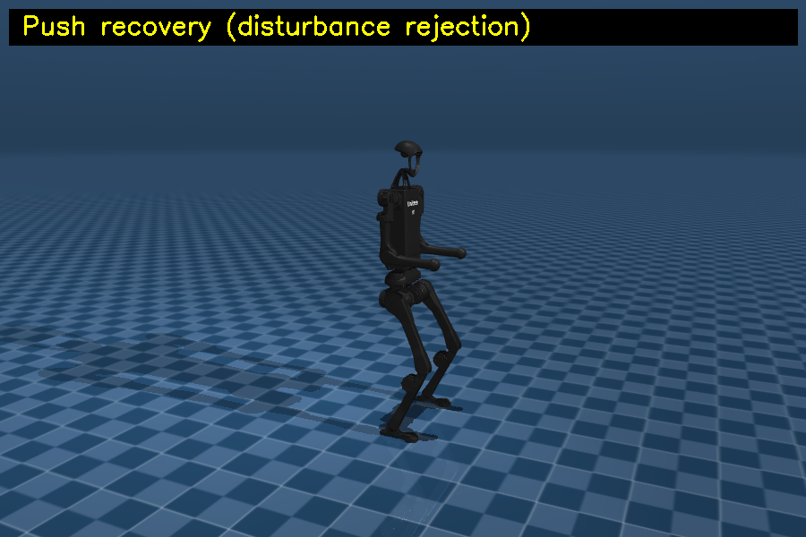 **③ 抗扰动平衡** — 躯干受 95N 侧向冲量后被拉回 | 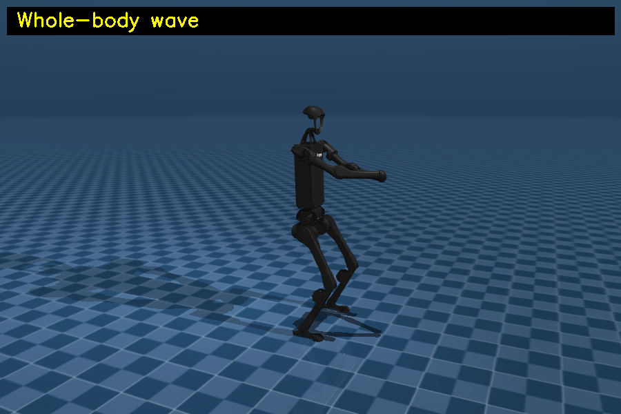 **④ 全身协同挥手** — 双臂上举摆动，与下肢解耦 |
| 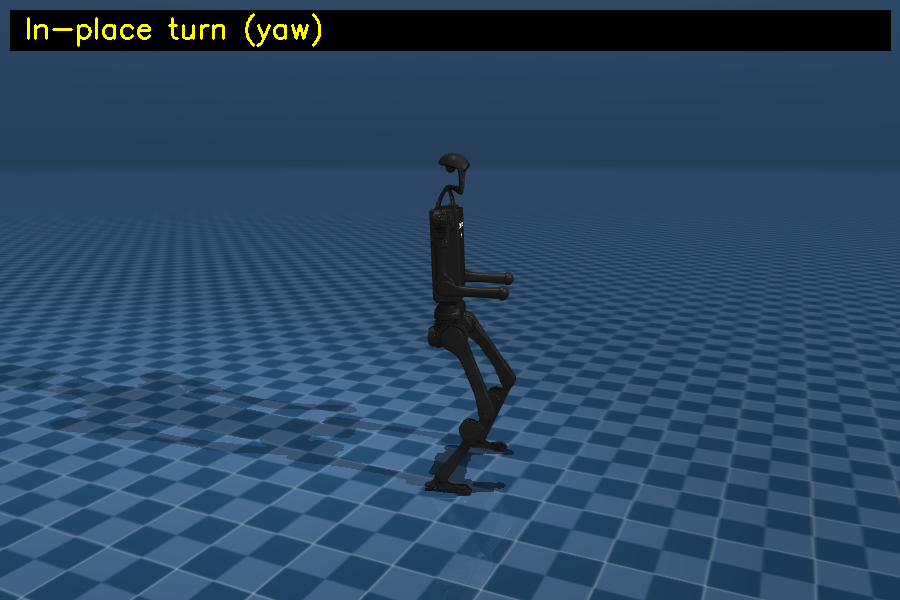 **⑤ 原地转向** — 基座偏航力矩 + 躯干联动 pivot | 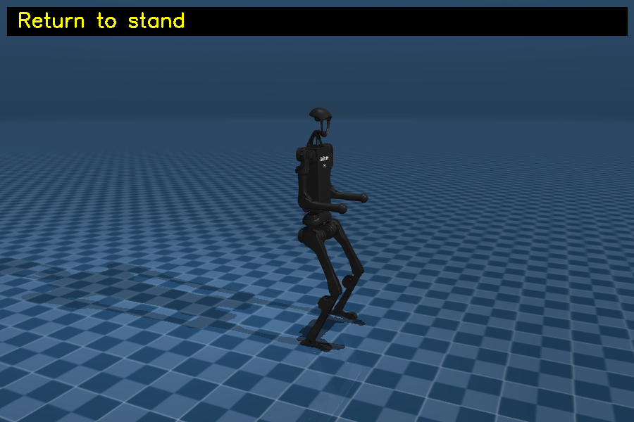 **⑥ 回正收尾** — 无超调地回到竖直 |

### 实测指标

| 指标 | 数值 |
|---|---|
| 行走时基座相对竖直偏差 | 约 **2°** |
| 95 N 侧向推搡下偏差峰值 | 约 **2°**，完整恢复 |
| 骨盆高度区间 | **[0.922, 0.977]** m（home = 0.98） |
| 全程是否跌倒 | **否** |

### 技术要点

| 技术点 | 实现 |
|---|---|
| 物理仿真 | MuJoCo + Menagerie 官方 **Unitree H1** 模型（19 自由度驱动） |
| 关节控制 | 每个驱动关节 **PD 力矩控制**（腿增益强、臂增益轻），跟踪解析轨迹 |
| 平衡 / 简化 WBC | 对浮动基座（骨盆）施加**六维力/力矩**（位置 + 姿态四元数误差），规避 rpy 奇异 |
| 轨迹生成 | 行走 / 挥手 / 转向均由**解析轨迹**生成，每步物理含义可解释（非黑箱 RL） |
| 渲染 | `mujoco.Renderer` 离线渲染 + 关键帧 PNG（headless，无需显示器） |

**一个关键工程细节**：**用四元数姿态误差而不是 rpy 角误差**来做基座姿态反馈。
欧拉角在 ±90° 附近有奇异，人形在受扰恢复时会短暂经过大角度姿态，
用 rpy 会突然拿到错误的误差方向，导致控制器"抽风"；四元数误差在整个姿态空间上都连续。

### 运行

```bash
python 05_humanoid_motion_control/humanoid_demo.py            # 出关键帧图片
python 05_humanoid_motion_control/humanoid_demo.py --check    # 只跑逻辑不渲染，校验是否摔倒
```

---

## 06 强化学习 · 掌内定向旋转

把 03 的灵巧手**原封不动**包装成标准 Gymnasium 环境，再用 PPO / SAC 从零学同一个任务：
不看示范、不给轨迹，只给奖励。

目的不是"再炫一个控制器"，而是给 **经典控制 vs 学习控制** 一个
**同环境、同任务、同评测**的公平对照 —— 这正是 03 与 06 共用同一只 Shadow Hand、
同一套成功判据的原因。

- **模型**：Shadow Hand E3M5（24 自由度，同 03，模型与脚本随仓库打包）
- **环境**：`gymnasium.Env` 五元组接口，`SubprocVecEnv ×4` 真并行采样
- **观测**：**63 维**本体感受 —— 24 关节角 + 24 关节速度 + 球位置(3)/四元数(4)/线速度(3)/角速度(3) + 当前角 + 目标角
- **动作**：**24 维**关节目标角（与 03 的关节空间协同**同一动作空间**）
- **依赖**：`mujoco` `numpy` `gymnasium` `stable-baselines3` `torch`（CPU）

### 结果：四种策略同环境对比

| 策略 | 训练步数 | 成功率 | 目标角度误差 | 掉球率 | 平均累计转角 | 平均回报 |
|---|---|---|---|---|---|---|
| **脚本专家**（03 同一套协同） | — | **100%** | **4.2°** | 0% | 93.8° | −22.2 |
| **PPO**（纯奖励） | 700k | **0%** | 42.3° | **0%** | 17° | −98.6 |
| **SAC**（纯奖励） | 200k | **0%** | 41.2° | **0%** | 17° | −102.5 |
| 随机策略 | — | 0% | 85.3° | 50% | 701.6° | −629.2 |

| PPO 学习曲线 | SAC 学习曲线 |
|---|---|
| 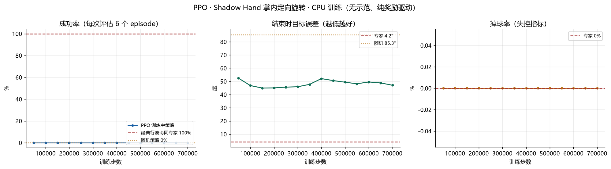 | 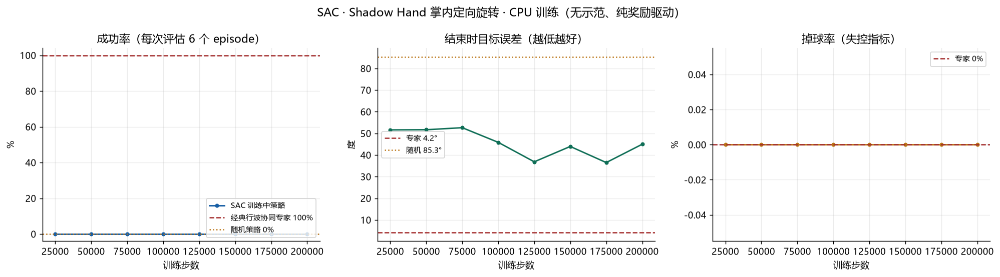 |

**这张表是 06 最有价值的东西。** 它不是"RL 没训好"，而是一条可复现的结论：

- 两种算法都把误差从随机的 **85.3° 压到 41~42°**、把掉球率从 **50% 压到 0%** —— 它们**确实学到了东西**：
  "握稳别掉球"。但代价是累计转角只有 **17°**，也就是**几乎不做搓球动作**。
- **关键证据：PPO 与 SAC 的最后几列几乎完全重合**（误差 42.3° vs 41.2°、累计转角都是 17°、掉球都是 0%）。
  一个是 on-policy、一个是 off-policy；一个靠 GAE + 裁剪，一个靠经验回放 + 最大熵 ——
  手段完全不同，却收敛到**同一个解**。这排除了"是不是算法没调好"的疑问：
  问题不在算法，而在**任务在纯奖励下的探索结构**。
- 机理很清楚：掉球惩罚重 → 最优解是"手别乱动"。要跨过这一步，必须先把球搓起来才
  知道后面有更大的奖励，而纯随机探索撞不出这条**窄路**。这就是接触富集操作里经典的
  **探索壁垒（exploration barrier）**。
- 于是结论很清楚：**接触富集的精细时序操作，纯 RL 从零学需要远超本次 CPU 预算的算力**
  （PPO 700k 步 ≈ 946 s、SAC 200k 步 ≈ 651 s；典型机器人 RL 论文用 GPU 集群跑 1e8~1e9 步）。

这正是 07 引入示范的动机 —— 也是真实项目里最该先想清楚的一件事。

### 延伸实验：用 BC 权重热启动 PPO

既然纯 RL 撞不过探索壁垒，一个自然的想法是**用示范给 RL 一个起点**。
07 的 BC 是 `63→256→256→24` 的 MLP，而 SB3 的 `ActorCriticPolicy`
（`net_arch=[256,256]`）里 `policy_net` 恰好也是 `63→256→256`、`action_net` 是 `256→24`
—— **逐层形状完全一致**，所以可以直接把 BC 权重搬进 PPO 的 Actor，不需要任何对齐技巧。

| 策略 | 步数 | 目标误差 | 成功率 | 掉球率 | 平均累计转角 |
|---|---|---|---|---|---|
| PPO 从零学（纯奖励） | 700k | 42.3° | 0% | 0% | 17° |
| **PPO + BC 热启动** | **300k** | **38.2°** | 0% | 0% | 20° |

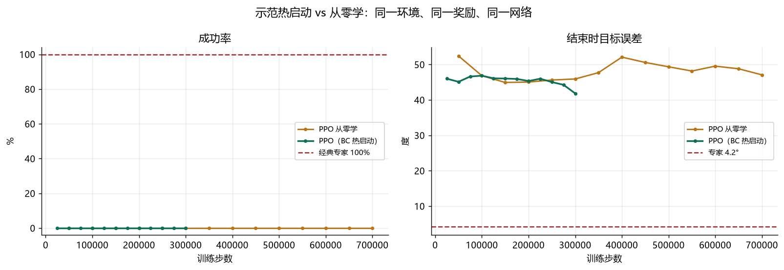

**结果诚实地说：有改善，但没突破。** 用**不到一半的预算**（300k vs 700k）拿到了略低的
误差（38.2° vs 42.3°），但成功率依旧是 0%，累计转角依旧停在 20° —— 它还是"握稳不动"。

原因正好回到 07 的主题：**BC 学的是条件均值，而示范是多模态的**。
把"九个模式的平均"当作起点交给 RL，等于让 RL 从一个**谁都不是**的地方出发，
那里没有一条清晰的改进方向。真正有效的做法应该是**多模态初始化**
（比如从 Diffusion Policy 采一个**具体模式**再交给 RL），而不是从均值出发 ——
这个反例，只有把 06 和 07 连起来看才看得见。

### 训练吞吐工程：环境 2.24×，训练 1.74×

RL 项目的瓶颈常常不在算法，而在**每秒能采多少步**。本项目把这件事当成一等公民：

| 阶段 | 优化前 | 优化后 | 倍数 |
|---|---|---|---|
| 环境单步吞吐 | 1044 步/秒 | **2335 步/秒** | **2.24×** |
| 端到端训练 | 615 步/秒 | **1073 步/秒** | **1.74×** |

三处关键改动，全部有实测依据：

| 改动 | 依据 |
|---|---|
| 跳过 `free_builtin()` 的每步 ctrl 写入 | 增益/偏置已全零 ⇒ 执行器力恒为 0 ⇒ **写 ctrl 是可证明的无效操作**；等价性用 400 步轨迹**逐位相同**（最大绝对差 `0.0`）证明 |
| `_ball_contacts()` 向量化 | 原来逐 `contact` 构造 `MjContact` 包装对象 ~85 µs/步 → **8 µs/步** |
| `torch.set_num_threads(1)` | 4 个环境 worker 已占满 4 核，torch 再开多线程做反向传播只会**互相抢核**（rollout 吞吐 957 → 1222 步/秒） |
| `n_steps=3072 / batch=512 / epochs=3` | 原设置下**梯度更新占总时长 36%** → 降到 **11%** |

`bench_speed.py` 把"采样 rollout"与"梯度更新"**分开计时**，直接暴露梯度占比 —— 这个方法本身也留在仓库里。

### 技术要点

| 技术点 | 实现 |
|---|---|
| 奖励不可作弊 | 角度用**四元数测地距离** `θ = 2·acos\|⟨q_ref, q_now⟩\| ∈ [0, π]`，直接反映球的真实姿态，无法通过"抖关节"刷分 |
| 成功判定需 dwell | 连续 **60 步（0.12 s）** 落在 **10° 容差**内才算成功；否则粗暴挥动可能**偶然扫过**目标角造成假成功 |
| 目标区间按实测收紧 | 专家净转角会**饱和**在 ~110°（五指"笼子"推向锁定姿态），所以采样区间定为 **25°–75°**，而不是理论上的 ±180° |
| 向量环境选型 | `SubprocVecEnv`（2043 步/秒）> `DummyVecEnv`（1567 步/秒），GIL 是后者的天花板 |
| 三种基线同图 | 每次评估同时跑**脚本专家**与**随机策略**，画成两条参照线，防止"曲线看起来在涨"的自欺 |

### 运行

```bash
# 环境自检：观测/动作维度、奖励范围、专家成功率（秒级）
python 06_reinforcement_learning/probe_env.py

# 吞吐基准：对比不同 n_envs / n_steps / 线程数的等效 fps
python 06_reinforcement_learning/bench_speed.py

# 训练（默认 1M 步；本项目主结果用 700k）
python 06_reinforcement_learning/train_rl.py --algo ppo --steps 700000
python 06_reinforcement_learning/train_rl.py --algo sac --steps 200000

# 用 07 训练好的 BC 权重热启动 PPO（与"从零学"对照）
python 06_reinforcement_learning/train_rl_from_demo.py --steps 300000

# 专家参数网格扫描（03 协同参数的再标定）
python 06_reinforcement_learning/scan_expert.py
```

产 `results/{ppo,sac,ppo_warm}_learning_curve.png`、对应的 `*_metrics.json` 与
`*_train.log`，以及 `results/speed_bench.json`；模型 `results/*_shadow_hand.zip`
不入库（跑一遍训练即可重新生成）。

---

## 07 模仿学习 · BC / ACT / Diffusion Policy

06 的结论是"纯 RL 从零学不会"，于是 07 换一条路：**给示范**。
但这里要回答的不是"能不能训出一个能用的策略"，而是一个更尖锐的问题：

> **当示范本身是多模态的（同一个观测下，好几种做法都合理），不同的模仿学习算法会怎样？**

这正是行为克隆（BC）在真实数据上失效的经典原因，也是 Diffusion Policy 这类方法的立足点。
本项目把这件"通常只是嘴上说说"的事，做成了**可测量的实验**。

- **环境**：与 06 **完全相同**（同一份 `hand_env.py`，63 维观测 / 24 维动作 / 同一成功判据）
- **示范**：9 套专家策略 × 随机初始相位，150 集 / 124,297 步 / 成功率 **80.7%**
- **依赖**：`mujoco` `numpy` `torch`（CPU）`scikit-learn` `matplotlib`

### 一、多模态示范是怎么"造"出来的

`expert_modes.py` 提供 **9 套互相独立、都能成功**的掌内搓球策略 ——
它们都来自 03 的"四指行波 + 拇指反摆"波形，只是幅度 / 频率 / 波数 / 不对称度 /
拇指反摆系数 / J1 耦合系数不同：

| 模式 | 参数特点 | 采集集数 | 单集成功率 | 平均累计转角 |
|---|---|---|---|---|
| A 基准协同 | 03 默认参数 | 18 | 94.4% | 107.3° |
| B 低幅 | 幅度 ×0.8 | 11 | 72.7% | 114.1° |
| C 低频 | 2.4 → 1.9 Hz | 18 | **100%** | 104.5° |
| D 高频 | 2.4 → 3.0 Hz | 14 | 92.9% | 102.7° |
| E 弱波数 | 波数 1.6 → 0.9 | 14 | 50.0% | **181.2°** |
| F 强不对称 | 不对称度 0.30 → 0.45 | 18 | 77.8% | 158.3° |
| G 拇指强反摆 | 拇指系数 −0.35 → −0.70 | 20 | 95.0% | 106.4° |
| H 无 J1 耦合 | 去掉 J1 耦合 | 16 | 43.8% | **79.2°** |
| I 高幅低频 | 幅度 ×1.15 + 低频 | 21 | 85.7% | 146.3° |

**关键在最后一列差了 2 倍多**（79.2° ~ 181.2°）：这 9 套策略走的是**很不一样的动作轨迹**，
而不是同一条轨迹的微扰。再加上每一集**随机化初始行波相位**，
同一个"球当前角度"就会出现在很不同的手指相位下 ——
"同一观测 → 多种动作"于是成了数据里的**客观事实**，而不是设定。

### 二、多模态是客观可测的，不是嘴上说的

采集脚本自带诊断：取 2000 组**近邻观测对**（并**排除同一 episode 内时间相邻**的点对 ——
否则周期性动作会让最近邻距离恒为 0），看这些"看起来差不多"的观测，动作到底一不一样：

| 诊断量 | 数值 | 含义 |
|---|---|---|
| 近邻对的平均观测距离 | 1.007 | "近邻"确实是近的 |
| 跨模式 / 同模式 近邻对 | **156 / 237** | 观测相近的样本里，**确实混着不同模式** |
| 近邻对的动作分歧 | 0.066 | 观测那么近，动作却差这么多 |
| 动作自身尺度 | 1.492 | 分歧占动作尺度 **4.4%** |
| **簇间 / 簇内 动作方差比** | **6.15** | 动作差异**主要来自"模式"，不是噪声** |
| k-means(k=4) 轮廓系数 | 0.441 | 动作空间里模式确实是分得开的簇 |

### 三、三种算法：同一份数据，三种归纳偏置

| 算法 | 做法 | 归纳偏置 |
|---|---|---|
| **BC** | 63→256→256→24 MLP，直接回归动作块 | 学**条件均值** → 多模态下落到"无人区" |
| **ACT-lite** | CVAE：编码器看「观测块 + 动作块」推隐变量 `z`（32 维），解码器用 `z` 重建动作块 | `z` 的取值决定复现哪个模式（推理时取 `z=0`） |
| **Diffusion Policy-lite** | 条件 DDPM（cosine 调度，T=100）对动作块加噪去噪，推理走 **DDIM 20 步** | 建模**整个动作分布** → 能采到具体模式 |

三者统一使用**动作分块**（H=8）+ **滚动重规划**（每 4 步重推一次）。
评测时对每个策略采 **128 个不同样本**（BC 因是确定性函数只能给出 1 个点；
ACT 必须**采 128 个不同 `z`**；DP 采 128 个不同噪声），再和示范分布比。

训练开销（CPU，同一份示范数据共 40,254 个动作块）：

| 算法 | 参数量 | 训练时长（60 epoch） | 验证损失 |
|---|---|---|---|
| BC | 88,344 | 233 s | 0.00104 |
| ACT-lite | 513,280 | 469 s | **0.00018** |
| DP-lite | 309,952 | 549 s | 0.18488 |

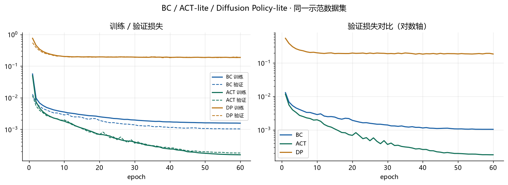

> DP 的损失是**噪声预测 MSE**，量级天然不同于 BC/ACT 的动作回归 MSE
> （纯噪声水平 ≈ 1.0），**不可直接横向比较** —— 它只反映扩散模型学到了多少结构。

### 四、闭环结果：**损失最低的模型，任务做得最差**

每个策略在同一批固定种子的 **30 个 episode** 上评测：

| 策略 | 成功率 | 结束时目标误差 | 掉球率 | 平均累计转角 | 动作抖动（帧间变化） |
|---|---|---|---|---|---|
| 随机动作 | 0% | 59.0° | 63.3% | 644.7° | 15.99 |
| 脚本专家（A 套，上界参考） | **96.7%** | **4.4°** | 0% | 97.0° | 0.11 |
| **BC** | 6.7% | 37.9° | 0% | 28.2° | **0.02** |
| **ACT-lite** | 0% | 44.9° | 0% | 9.2° | 0.15 |
| **Diffusion Policy-lite** | **26.7%** | **24.8°** | 0% | 111.7° | 1.83 |

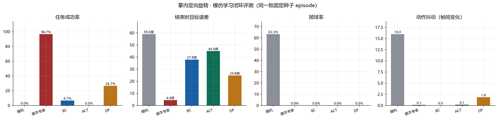

把两个数字并排看，会得到本项目最反直觉、也最该被记住的一行：

| 策略 | 训练验证损失 | | 闭环成功率 |
|---|---|---|---|
| ACT-lite | **0.0002**（最低） | | 0% |
| BC | 0.0010 | | 6.7% |
| DP-lite | 0.1849（最高） | | **26.7%** |

**损失与任务表现完全反相关。** 这只有在"示范是多模态"的前提下才成立：
MSE 的最优解是**条件均值**，而条件均值在闭环里谁都不是 —— 开环执行几步就偏离了，
所以 BC/ACT 越是把损失压低（越是精确地学到了平均值），闭环表现反而越差；
DP 的回归目标（预测噪声）看起来"学得差"，但它建模的是整个分布，
采样落在**真实存在过的动作**上，闭环成功率就上去了。

> 这一条对做具身智能的人应该很直接：**在操作类任务里，离线损失不是好指标，
> 甚至是个反向指标。** 动作抖动那一列也值得看 —— BC 的 0.02 极其平滑，
> 因为它输出的是被平均过的固定动作；**平滑不等于好**。

### 五、多模态复现度：BC 永远只能给一个答案

先看一张最直观的图。在示范数据里找一个"观测很接近、但动作分歧很大"的邻域
（250 条示范，混了 5 种专家模式），把三个策略在同一观测下的采样画出来：

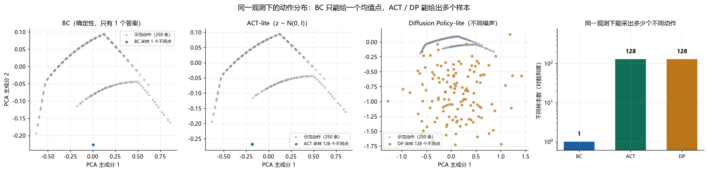

- **BC（左）只有一个点**，而且它落在示范点云（灰）的**空隙里** —— 这就是"条件均值
  落在无人区"的可视化。
- ACT（中）能给出 128 个不同样本，但它们挤成一小团。
- DP（右）的 128 个样本铺得很开 —— 但它也**整体偏离**了示范点云（这件事下面会讲）。

单个邻域的结果对"挑哪个点"比较敏感（换个点覆盖率可能从 0% 跳到 20%），
所以再给一组**在 20 个随机观测点上取平均**的稳健统计：

| 策略 | 同一观测下能采出几个**不同**动作 | 样本到最近真实动作 | 是"示范内部典型间距"（0.006）的几倍 |
|---|---|---|---|
| **BC** | **1.0** | 0.056 | **8.7×** |
| **ACT-lite** | 32.0 | 0.065 | 10.1× |
| **DP-lite** | 32.0 | 1.192 | **185×** |

第一列就是这件事的**铁证**：无论采多少次，**BC 永远只给同一个动作**（1.0）。
这不是训练不够，而是确定性映射的数学必然 —— 给定观测 `o`，`f(o)` 只有一个值。
而它的输出离最近真实动作是示范内部间距的 **8.7 倍**，说明它确实落在"无人区"里。

**DP 这一栏要诚实说清楚**：它能采样、也是全场闭环成功率最高的策略（26.7%），
但在"单步动作对齐"这个指标上偏离示范 **185 倍**。原因是本项目的 DP-lite 是
**MLP 主干 + T=100 + 60 epoch** 的极简版，容量不足以精确复现分布。
它的价值体现在**闭环成功**上，而不是单步动作匹配 —— 这两件事本来就不是一回事。
（真要把分布复现到这个精度，工业界的 Diffusion Policy 用的是 UNet / DiT 主干，
参数量和训练量都在本项目的一到两个数量级以上。）

### 六、技术要点（这里的坑比 06 更深）

| 坑 | 现象 | 修法 |
|---|---|---|
| **多模态阈值 τ 的"三代错误"** | 第一代取 `τ=0` → 周期性动作让最近邻距离恒为 0，覆盖率永远是 0 | 排除时间相邻步（`\|i−j\| > 30`）**且**排除 query 所在整个 episode |
| ↑ 继续 | 第二代改成"去重后最近邻距离中位数" → 仍被**采样密度**主导（同模式的点连续稠密） | 最终改为**按模式中心间距中位数的一半**定阈值（得 τ ≈ 0.67），与采样密度解耦 |
| **BC 与 ACT/DP 的采样形状不一致** | BC 返回 `(B,n,A)`、ACT/DP 返回 `(B,n,H,A)`，多模态对比直接崩 | 统一成四维 `(B, n, H, A)` |
| **ACT 采样退化成同一个点** | 128 个样本全是同一个 `z` → 多模态对比结论完全失真 | 采样时必须 `torch.randn(n, z_dim)`，**每个样本一个 `z`** |
| **动作块不能用"时序集成"** | 想用平均多步预测来平滑，结果**跨模式平均掉**了差异 | 改成 receding horizon（只用最新一次预测的前 `replan` 步） |
| **最近邻构造爆内存** | 12 万 × 12 万距离矩阵 | 用 `NearestNeighbors` 分批查询 |
| **DDPM 在短 T 下不能用线性 β** | 照搬 DDPM 原文的 `linspace(1e-4, 0.02, 50)`，`abar(T)` 只降到 **0.60** —— 加噪过程根本没走到"接近纯噪声"，而采样却从纯噪声出发，训练分布与采样分布不匹配；生成的动作**整片飘离示范**（到最近示范动作的距离是示范内部间距的 **247 倍**）。最坑的是**它的闭环成功率反而是三个策略里最高的**，极易被误判成"DP 就这样、理论不对" | 换成 **cosine 调度 + T=100**（`abar(T)≈3e-4`）：验证损失 0.281 → **0.185**，采样偏离 247× → 185×，命中模式数 0.05 → **0.90** |

### 运行

```bash
cd 07_imitation_learning

# 1) 采集示范（150 集，约 90 s），并打印多模态诊断
python collect_demos.py --episodes 150 --tag v1

# 2) 训练三种策略（BC / ACT / DP）
python train_il.py --algo all --demos v1 --epochs 60 --stride 2

# 3) 评测 + 多模态复现度分析
python eval_il.py --demos v1 --episodes 30 --tag v1

# 只重算多模态分析（跳过慢的闭环评测），--survey 追加多观测点稳健统计
python eval_il.py --demos v1 --tag v1 --mm-only --survey
```

产 `results/il_comparison.png`（闭环对比）、`il_multimodality.png`（多模态复现度）、
`il_loss_curves.png`（三种算法的损失曲线）与 `il_eval_v1.json`（全部指标）。

## 08 力控与 MPC · 阻抗控制 / MPC / ONNX 部署

同一个灵巧手，回答四个"把策略送上真机"必须回答的问题：

1. **抓不抓得住** —— 接触力多大、受扰动会不会掉？→ 阻抗控制 / 力控
2. **够不够准** —— 多指协同跟踪，MPC 比反应式 IK 强在哪？→ 凸优化
3. **跑不跑得动** —— 策略能不能导出、推理延迟扛不扛得住控制周期？→ ONNX 部署
4. **动力学算得对不对** —— 不调引擎，自己写一遍质量矩阵与逆动力学，对拍得上吗？→ 刚体动力学

### 一、阻抗控制与接触力

对握持中的球施加 **6 N 脉冲扰动（0.10–0.30 s）**，三档刚度各跑一遍：

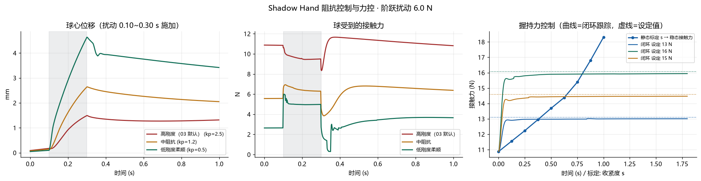

| 刚度档（kp·kd） | 静息接触力 | 峰值接触力 | 峰值位移 | 残余位移 | 是否掉球 |
|---|---|---|---|---|---|
| **高刚度**（03 默认，2.5·0.05） | 10.88 N | 11.66 N | 1.49 mm | 1.31 mm | 否 |
| **中阻抗**（1.2·0.10） | 5.56 N | 6.93 N | 2.64 mm | 2.07 mm | 否 |
| **低刚度柔顺**（0.5·0.15） | 2.64 N | **6.00 N** | 4.64 mm | 3.46 mm | 否 |

**这张表讲的是同一个权衡**：越低刚度越"软"（位移大），但**传给球的力峰值几乎等于扰动力本身**
（低刚度下峰值 6.00 N ≈ 扰动 6 N —— 因为它几乎不抵抗，力原封不动传过来）；
越高刚度越"硬"（位移小），但静息接触力也越高（**10.88 N 的夹持力对易碎件就是灾难**）。
真机的抓取参数就是这么选出来的。

**力控闭环**（标定 + 积分修正）：

| 环节 | 结果 |
|---|---|
| 力标定（开合标量 0→1 扫描） | 接触力 **10.88 → 18.31 N 单调递增**（9 个采样点） |
| 闭环跟踪（3 个设定值） | 稳态误差 **−0.10 / −0.14 / −0.12 N**，相对误差 **< 1%** |

### 二、MPC vs DLS-IK：多指协同跟踪

5 个指尖跟踪同一条正弦参考轨迹（幅值 12 mm、1.5 Hz、150 步 × 20 ms = 3 s）：

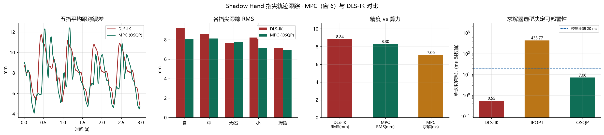

| 指标 | DLS-IK（反应式） | **MPC（OSQP）** | MPC（IPOPT） |
|---|---|---|---|
| 指尖 RMS 误差 | 8.84 mm | **8.30 mm** | 9.11 mm |
| 指尖最大误差 | 15.70 mm | **14.63 mm** | 13.23 mm |
| **触碰关节限位步数** | **129 / 150** | **0** | 0 |
| 单步求解均值 | **0.55 ms** | 7.06 ms | 433.77 ms |
| 单步求解 p95 | 2.00 ms | 11.99 ms | 584.33 ms |
| 能否满足 20 ms 控制周期 | ✅ | **✅** | ❌ |

两个结论：

- **精度**：MPC 略优（8.30 vs 8.84 mm），但**真正的差别在约束** ——
  DLS-IK 有 **129/150 步**在**硬撞关节限位**（反应式方法"到墙才停"），
  MPC 把限位写进优化约束，**一次都没撞**。对真机意味着更少的减速机磨损和更可预期的行为。
- **可部署性**：同一个 QP，**IPOPT 要 433.77 ms**，**OSQP 只要 7.06 ms —— 差 61 倍**。
  IPOPT 是通用非线性求解器，OSQP 是专用凸 QP 求解器。**Q 问题就该用 QP 求解器**，
  否则一个"数学上更通用"的选择会直接把算法挡在实时性门外。

### 三、ONNX 部署与推理延迟

把 06 训练好的 PPO 策略（只含 `policy_net` + `action_net`，**88,344 参数 / 346 KB**）导出成 ONNX：

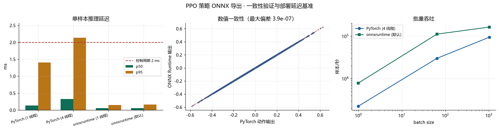

| 后端 | p50 | p95 | p95 / p50 |
|---|---|---|---|
| PyTorch（1 线程） | 0.136 ms | 1.407 ms | **10.3×** |
| PyTorch（4 线程） | 0.330 ms | 2.138 ms | 6.5× |
| **onnxruntime（1 线程）** | 0.059 ms | **0.152 ms** | **2.6×** |
| onnxruntime（默认） | 0.057 ms | 0.167 ms | 2.9× |

**ONNX 的价值不只是"快"，而是"稳"。** 单看 p50，torch 1 线程（0.136 ms）和 ORT（0.059 ms）
只差 2 倍；但看 **p95**，torch 是 **1.407 ms**、ORT 只要 **0.152 ms** —— **抖动小 9.4×**。
实时控制怕的从来不是平均延迟，而是**尾延迟**：torch 4 线程的 p95 = 2.138 ms 已经**超出 2 ms 控制周期**，
而 ORT 还有 13 倍余量。

| 附加验证 | 结果 |
|---|---|
| 数值一致性（torch vs ONNX） | 最大绝对偏差 **3.9e-7**、相对偏差 **6.2e-7**（float32 精度极限） |
| 批量吞吐（batch = 1 / 64 / 1024） | ORT **7876 / 111454 / 163136** 样本/秒 vs torch 2251 / 30046 / 94252 |
| 导出路径 | torch 2.11 默认走 dynamo，需 `dynamo=False` 回落到 TorchScript 导出器 |

### 四、刚体动力学：手写实现与引擎对拍

前面的动力学都是「**用**引擎」：调 `qfrc_bias` 拿重力/科氏力，调 `mj_step` 推进物理。
这一节把「**实现**动力学」补上——用定义式手写质量矩阵与逆动力学，再与引擎里两个
**算法路径完全不同**的实现逐元素对拍（手写是全矩阵组装，引擎是递归递推）：

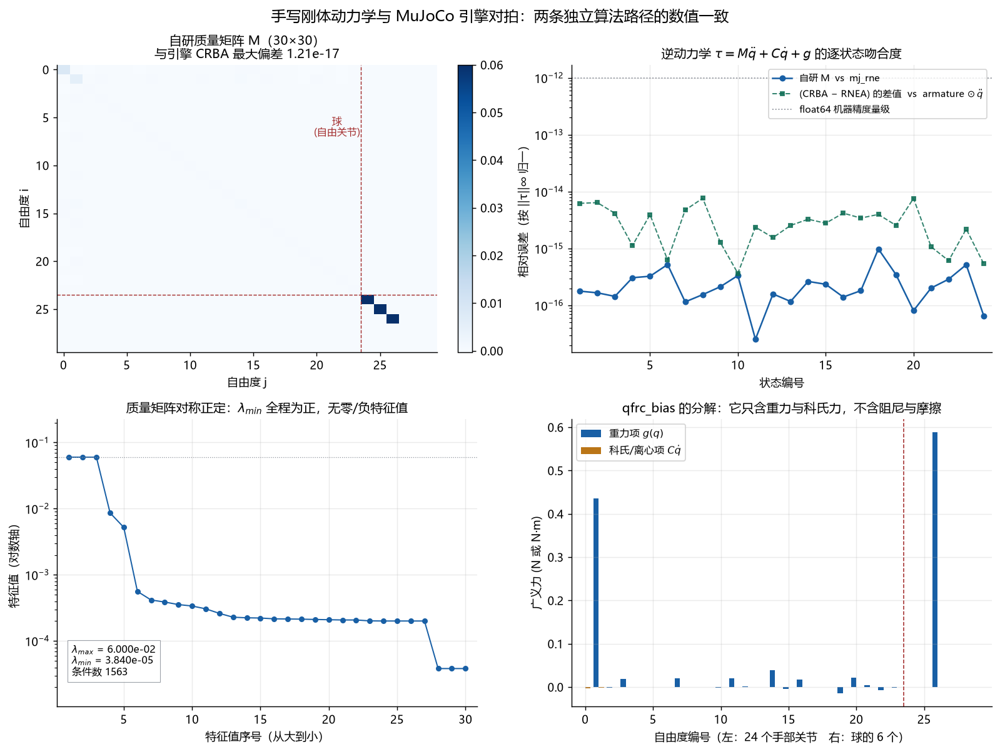

**手写的部分**（24 个状态，含球共 30 个自由度）：

```
M(q) = Σ_i [ m_i · Jᵖᵢᵀ Jᵖᵢ + Jʳᵢᵀ · I_i(world) · Jʳᵢ ] + diag(armature)
```

逐 body 累加「质心线速度雅可比 + 角速度雅可比」的二次型——这就是质量矩阵的定义式
（系统动能 = ½·q̇ᵀMq̇ 展开后的二次型）。雅可比与惯量参数由引擎提供，**组装是手写的**，
不调用任何动力学算法。

| 对拍项 | 参照对象 | 最大相对偏差 |
|---|---|---|
| 质量矩阵 M(q) | `mj_fullM`（CRBA 复合刚体算法） | **2.02e-16** |
| 逆动力学 τ = M·q̈ + C·q̇ + g | `mj_rne`（RNEA 递归牛顿-欧拉） | **9.83e-16** |
| 科氏项二次齐次性 C(αq̇) = α²·C(q̇) | 解析性质（α = 2.5） | 1.64e-13 |
| 哨兵：`mj_rne(flg_acc=0)` vs `qfrc_bias` | — | **0（逐位相等）** |

**顺带查出引擎内部一个不一致**：`mj_fullM`(CRBA) **含**转子惯量 armature，
而 `mj_rne`(RNEA) **不含**。

第一版手写 M 没加 armature，对拍给出 3.3e-3 的相对偏差——再查发现差异**全部落在对角线上**、
且与 `diag(dof_armature = 2e-4)` 逐位吻合；补上后降到 2e-16。但补上之后逆动力学的对拍误差
反而涨到 1.5e-2，因为 RNEA 本来就不含 armature。**两条约定都对，只是不一样**：
对拍 CRBA 要用含 armature 的 M，对拍 RNEA 要用不含的，两者之差恰好是 `armature ⊙ q̈`
（实测相对偏差 7.6e-15）。

> 这是个真实的坑：只写实现不做对拍，这 2e-4 会一直藏着，
> 直到某天用它算逆动力学时，表现为一个说不清来源的力矩偏差。

| 附加记录 | 结果 |
|---|---|
| M 的对称性 | ‖M − Mᵀ‖ = **5.4e-20** |
| M 的正定性 | 30 个特征值全为正，范围 [3.84e-5, 6.00e-2]，条件数 1563 |
| 手写 M 的耗时 | 1.02 ms/次（引擎 `mj_fullM` 0.007 ms，**慢 143×** —— 对拍用，不进控制回路） |

### 技术要点（全部是踩过的坑）

| 坑 | 现象 | 修法 |
|---|---|---|
| **力控：整体收紧 ≠ 定向挤压** | 用 03 的"hard 抓握"整体收紧，球被**挤出掌窝**，力反倒从 10.9 掉到 9.5 N 并饱和 | 改成**定向小挤压**（只推四指末节 + 拇指反向，0.20 rad），标定才单调 |
| **力控：闭环前忘了复位** | 曲线是平的，控制器压根没生效 | `force_tracking` 建完 rig **必须 `reset()`**，否则球没在掌窝里 |
| **MPC：参数展平顺序** | 求解器收到的雅可比是打乱的 | 传 casadi 前必须 `J.ravel(order="F")` —— **casadi `reshape` 是列优先**，`order="C"` 会静默错位 |
| **MPC：起始姿态顶在限位上** | IPOPT 返回不可行解（129/150 步撞限位） | 起始位姿收进行程内部（`POS_MARGIN=0.10`）+ 约束内缩 2%，硬约束才留出可行域 |
| **MPC：casadi 的 OSQP 插件不可用** | `Plugin 'osqp' is not found` | 改用 **osqp 的 Python API**，手动把 MPC 消元成标准 QP（`H/g/A/l/u`） |
| **ONNX：`onnxscript` 缺失** | torch 2.11 默认 dynamo 导出直接报错 | 加 `dynamo=False`，走稳定的 TorchScript 路径 |
| **ONNX：参数量统计错** | 导出时把 `value_net` 也算进去（170,520） | 只挂 `policy_net` + `action_net`，得 **88,344** |
| **动力学：引擎两个函数约定不一致** | 手写 M 与 `mj_fullM` 差 3.3e-3，但差异**全在对角线上** | `mj_fullM`(CRBA) **含** armature、`mj_rne`(RNEA) **不含**；对拍要各用各的约定，两者之差恰为 `armature ⊙ q̈` |
| **MuJoCo 3.x 的 API 改名** | `data.qM` 不再存在（现为 `data.M`）；`mj_fullM(m, dst, M)` 变成 `mj_fullM(m, d, dst)` | 老教程的写法在 3.x 上直接报 `AttributeError` / `TypeError` |

### 运行

```bash
# 依赖：mujoco numpy matplotlib scipy casadi osqp onnx onnxruntime torch
python 08_force_control_and_mpc/impedance_control.py        # 三档刚度 + 力标定 + 闭环跟踪
python 08_force_control_and_mpc/mpc_control.py              # DLS-IK vs MPC(OSQP) vs MPC(IPOPT)
python 08_force_control_and_mpc/deploy_onnx.py              # 导出 ONNX + 延迟/吞吐基准
python 08_force_control_and_mpc/rigid_body_dynamics.py      # 手写质量矩阵/逆动力学 vs 引擎对拍
```

产 `results/impedance_force.png`、`mpc_vs_ik.png`、`onnx_benchmark.png`、`dynamics_check.png`
与四个 metrics JSON，以及入库的 `results/policy.onnx`（346 KB，可直接用 onnxruntime 加载）。

> `deploy_onnx.py` 默认读取 `08_force_control_and_mpc/results/ppo_shadow_hand.zip`（不入库）。
> 先跑一次 06 的训练，或从 `06_reinforcement_learning/results/` 复制过来即可。

---

## 技术对照

八个项目刻意选择了不同的机器人本体与不同的控制层次，合起来是一条完整的能力线。
先看经典控制层（01–05）：

| | 01 机械臂 | 02 人形·物流带 | 03 灵巧手 | 04 人形·工位 | 05 人形·运动控制 |
|---|---|---|---|---|---|
| 本体 | 7-DoF 固定基座臂 | 19-DoF 人形 | 24-DoF 多指手 | 19-DoF 人形 | 19-DoF 人形 |
| 任务层 | 抓取-放置闭环 | 队列分拣节拍 | 接触丰富掌内操纵 | 单件抓取-放置 | 行走 / 平衡 / 转向 |
| 运动学 | DLS 逆运动学（6-DoF 位姿） | 5-DoF 全身 IK（腰 + 臂） | 关节空间协同 + 接触约束 | 4-DoF 臂 IK + 多初值 | 解析轨迹（关节空间） |
| 控制层 | 位置执行器 | PD 力矩 + 重力补偿 | 自写 PD 力矩 + 重力补偿 | PD 力矩 + 六维基座稳定 | PD 力矩 + 六维基座稳定 |
| 感知接口 | `classify()` 可插拔 | `classify()` 可插拔 | —（接触即状态） | `classify()` 可插拔 | —（本体感受） |
| 核心难点 | 奇异抑制、状态隔离 | 冗余自由度分配 | 传动耦合、滚动接触 | 实测标定、索引陷阱 | 姿态奇异、抗扰恢复 |

再看学习与优化层（06–08）—— 三者共用 03 的 Shadow Hand 与**完全相同的环境、观测、动作、成功判据**，
所以它们的差异只来自方法本身：

| | 06 强化学习 | 07 模仿学习 | 08 力控与 MPC |
|---|---|---|---|
| 学习信号 | 奖励（**无示范**） | 示范（9 套专家策略） | 模型（线性化动力学） |
| 算法 | PPO / SAC | BC / ACT / Diffusion Policy | 阻抗-力控 / 线性 MPC |
| 观测 / 动作 | 63 维本体感受 / 24 维关节目标角 | **同 06** | **同 06** |
| 成功率 | **0%**（握稳但没学会搓） | **26.7%**（DP）/ 6.7%（BC）/ 0%（ACT） | 力跟踪误差 **< 1%** |
| 一句话结论 | 纯 RL 从零学**跨不过探索壁垒** | 多模态下 **BC 平均化失效** | **求解器选型决定可部署性** |

跨项目的通用工程习惯：**IK / 规划一律在独立的 `ik_data` 上求解，绝不污染仿真 `data`**；
**场景道具与真值占位集中在构建函数里，换成真实感知或真机接口时控制层不动**；
**06/07/08 共用同一份 `hand_common.py` 与 `hand_env.py`**（四份副本 md5 一致），
保证"同环境对照"不是口头承诺，而是物理上同一套代码。

## 快速开始

**经典控制（01–05）** 只需三件套：

```bash
pip install mujoco numpy imageio

# 逐个跑（默认只输出关键帧图片到各自 frames/）
python 01_arm_logistics_sorting/logistics_sorting.py
python 02_humanoid_conveyor_sorting/humanoid_conveyor.py
python 03_dexterous_hand_manipulation/shadow_hand_demo.py
python 04_humanoid_workcell_sorting/humanoid_sorting.py
python 05_humanoid_motion_control/humanoid_demo.py

# 快速校验（不渲染，秒级返回结论）
python 02_humanoid_conveyor_sorting/humanoid_conveyor.py --check
python 03_dexterous_hand_manipulation/shadow_hand_demo.py --check
python 04_humanoid_workcell_sorting/humanoid_sorting.py --check
python 05_humanoid_motion_control/humanoid_demo.py --check

# 实时 3D 窗口（可拖拽视角）
python 01_arm_logistics_sorting/logistics_sorting.py --viewer
```

**学习与优化（06–08）** 需要额外依赖：

```bash
pip install gymnasium stable-baselines3 torch matplotlib scipy casadi osqp onnx onnxruntime

# 06 环境自检 + 吞吐基准（秒级）
python 06_reinforcement_learning/probe_env.py
python 06_reinforcement_learning/bench_speed.py
python 06_reinforcement_learning/train_rl.py --algo ppo --steps 700000   # 约 16 分钟

# 07 采集示范 → 训练三种策略 → 评测（含多模态分析）
python 07_imitation_learning/collect_demos.py --episodes 150 --tag v1
python 07_imitation_learning/train_il.py --algo all --demos v1 --epochs 60
python 07_imitation_learning/eval_il.py --demos v1 --episodes 30 --tag v1

# 08 力控 / MPC / ONNX 部署 / 刚体动力学对拍
python 08_force_control_and_mpc/impedance_control.py
python 08_force_control_and_mpc/mpc_control.py
python 08_force_control_and_mpc/deploy_onnx.py
python 08_force_control_and_mpc/rigid_body_dynamics.py
```

所有机器人的 MJCF 模型均已打包在各自子目录内，**无需下载 Menagerie 仓库**；
纯 CPU 运行，不需要 GPU 或额外硬件。所有图表均为离线渲染的 PNG，不产出视频。

## 仓库结构

```
EmbodiedSim_Demo/
├─ 01_arm_logistics_sorting/          # 机械臂 · 物流分拣
│   ├─ logistics_sorting.py
│   ├─ frames/                        # 6 张关键帧
│   └─ panda_model/                   # Franka Emika Panda（Menagerie）
├─ 02_humanoid_conveyor_sorting/      # 人形 · 物流带分拣（腰部回转）
│   ├─ humanoid_conveyor.py
│   ├─ probe5.py
│   ├─ frames/                        # 6 张关键帧
│   └─ unitree_h1_model/              # Unitree H1（Menagerie）
├─ 03_dexterous_hand_manipulation/    # 灵巧手 · 掌内操纵（06/07/08 的基础环境）
│   ├─ shadow_hand_demo.py
│   ├─ hand_common.py
│   ├─ probe_hand.py
│   ├─ scan_roll_params.py
│   ├─ frames/                        # 9 张关键帧
│   └─ shadow_hand_model/             # Shadow Hand E3M5（Menagerie）
├─ 04_humanoid_workcell_sorting/      # 人形 · 工位分拣
│   ├─ humanoid_sorting.py
│   ├─ frames/                        # 6 张关键帧
│   └─ unitree_h1_model/              # Unitree H1（Menagerie）
├─ 05_humanoid_motion_control/        # 人形 · 运动控制
│   ├─ humanoid_demo.py
│   ├─ frames/                        # 6 张关键帧
│   └─ unitree_h1_model/              # Unitree H1（Menagerie）
├─ 06_reinforcement_learning/         # 强化学习 · 掌内定向旋转
│   ├─ hand_common.py / hand_env.py   # 与 03 同源的灵巧手环境（Gymnasium 封装）
│   ├─ train_rl.py                    # PPO / SAC + 专家/随机双基线
│   ├─ train_rl_from_demo.py          # BC 权重热启动 PPO（与从零学对照）
│   ├─ bench_speed.py                 # rollout vs 梯度更新 拆分计时
│   ├─ probe_env.py / scan_expert.py
│   ├─ plot_style.py                  # 中文字体 + 统一配色
│   └─ shadow_hand_model/
├─ 07_imitation_learning/             # 模仿学习 · BC / ACT / Diffusion Policy
│   ├─ expert_modes.py                # 9 套可成功的多模态专家
│   ├─ collect_demos.py               # 示范采集 + 多模态诊断
│   ├─ il_models.py                   # BC / ACT-lite(CVAE) / DP-lite(DDPM)
│   ├─ train_il.py / eval_il.py       # 训练与评测（含覆盖率/精度/模式覆盖）
│   ├─ hand_common.py / hand_env.py / plot_style.py
│   └─ shadow_hand_model/
└─ 08_force_control_and_mpc/          # 力控与 MPC
    ├─ impedance_control.py           # 阻抗 / 力标定 / 力跟踪闭环
    ├─ mpc_control.py                 # DLS-IK vs MPC(OSQP) vs MPC(IPOPT)
    ├─ deploy_onnx.py                 # ONNX 导出 + 延迟/吞吐基准
    ├─ rigid_body_dynamics.py         # 手写质量矩阵/逆动力学 vs 引擎对拍
    ├─ hand_common.py / hand_env.py / plot_style.py
    └─ shadow_hand_model/
```

各机器人模型授权见对应子目录内的 `LICENSE`（均来自 MuJoCo Menagerie）。
`07` 的示范数据集与各项目的训练权重默认不入库（体积大且可一键重新生成），
仅保留一份 346 KB 的 `08/results/policy.onnx` 供部署演示直接加载。
